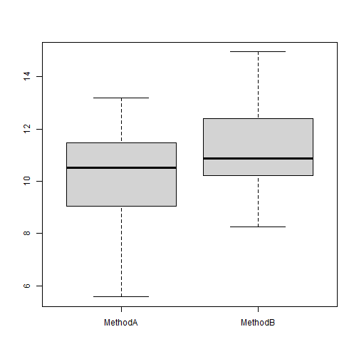

Considere dois métodos A e B, onde desejamos comparar os seus desempenhos.


``` r
#dado sintético 
set.seed(1)
trials <- 30
MethodA <- rnorm(trials, mean=10, sd = 2)
MethodB <- rnorm(trials, mean=11, sd = 2)
```


``` r
data <- data.frame(MethodA, MethodB)
head(data)
```

```
##     MethodA   MethodB
## 1  8.747092 13.717359
## 2 10.367287 10.794425
## 3  8.328743 11.775343
## 4 13.190562 10.892390
## 5 10.659016  8.245881
## 6  8.359063 10.170011
```

``` r
boxplot(data)
```



Realizando teste de normalidade usando Shapiro-Wilk

Hipotese nula: não há evidência que a distribuição não seja normal (p-value >= 0.05)

Hipotese alternativa: a distribuição não é normal (p-value < 0.05)


``` r
shapiro.test(MethodA)
```

```
## 
## 	Shapiro-Wilk normality test
## 
## data:  MethodA
## W = 0.95011, p-value = 0.1703
```


``` r
shapiro.test(MethodB)
```

```
## 
## 	Shapiro-Wilk normality test
## 
## data:  MethodB
## W = 0.98568, p-value = 0.9482
```

Realizando um segundo teste de usando Anderson-Darling


``` r
library(nortest)
```


``` r
ad.test(MethodA)
```

```
## 
## 	Anderson-Darling normality test
## 
## data:  MethodA
## A = 0.48213, p-value = 0.2142
```


``` r
ad.test(MethodB)
```

```
## 
## 	Anderson-Darling normality test
## 
## data:  MethodB
## A = 0.19575, p-value = 0.8818
```

Em sendo normal, pode-se aplicar o t-test.

A hipótese nula é que não evidência de diferença entre A e B (p-value >= 0.05)

A hipótese alternativa há diferença entre A e B (p-value < 0.05)


Há duas situações. 

Situação #1: A primeira é quando se quer comparar a média de A e B. Neste caso a comparação é das amostras. 


``` r
res <- t.test(MethodA, MethodB, paired=FALSE)
res
```

```
## 
## 	Welch Two Sample t-test
## 
## data:  MethodA and MethodB
## t = -2.4722, df = 56.741, p-value = 0.01645
## alternative hypothesis: true difference in means is not equal to 0
## 95 percent confidence interval:
##  -1.992223 -0.209043
## sample estimates:
## mean of x mean of y 
##  10.16492  11.26555
```


``` r
resL <- t.test(MethodA, MethodB, paired=FALSE, alternative = "less")
resL
```

```
## 
## 	Welch Two Sample t-test
## 
## data:  MethodA and MethodB
## t = -2.4722, df = 56.741, p-value = 0.008225
## alternative hypothesis: true difference in means is less than 0
## 95 percent confidence interval:
##        -Inf -0.3561861
## sample estimates:
## mean of x mean of y 
##  10.16492  11.26555
```

``` r
resG <- t.test(MethodA, MethodB, paired=FALSE, alternative = "greater")
resG
```

```
## 
## 	Welch Two Sample t-test
## 
## data:  MethodA and MethodB
## t = -2.4722, df = 56.741, p-value = 0.9918
## alternative hypothesis: true difference in means is greater than 0
## 95 percent confidence interval:
##  -1.84508      Inf
## sample estimates:
## mean of x mean of y 
##  10.16492  11.26555
```

Situação #2: Se quer comparar se as medidas individuais de A e B. Neste caso a comparação é pareada. 


``` r
res <- t.test(MethodA, MethodB, paired=TRUE)
res
```

```
## 
## 	Paired t-test
## 
## data:  MethodA and MethodB
## t = -2.5339, df = 29, p-value = 0.01694
## alternative hypothesis: true mean difference is not equal to 0
## 95 percent confidence interval:
##  -1.9889923 -0.2122734
## sample estimates:
## mean difference 
##       -1.100633
```

Execute este mesmo experimento com menos tentativas (trials) (5, 10)


``` r
resL <- t.test(MethodA, MethodB, paired=TRUE, alternative = "less")
resL
```

```
## 
## 	Paired t-test
## 
## data:  MethodA and MethodB
## t = -2.5339, df = 29, p-value = 0.00847
## alternative hypothesis: true mean difference is less than 0
## 95 percent confidence interval:
##        -Inf -0.3626054
## sample estimates:
## mean difference 
##       -1.100633
```

