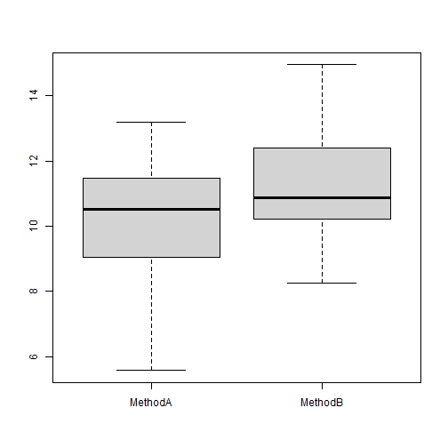

Considere dois métodos A e B, onde desejamos comparar os seus desempenhos.


``` r
#dado sintético 
set.seed(1)
trials <- 30
MethodA <- rnorm(trials, mean=10, sd = 2)
MethodB <- rnorm(trials, mean=11, sd = 2)
```


``` r
data <- data.frame(MethodA, MethodB)
head(data)
```

```
##     MethodA   MethodB
## 1  8.747092 13.717359
## 2 10.367287 10.794425
## 3  8.328743 11.775343
## 4 13.190562 10.892390
## 5 10.659016  8.245881
## 6  8.359063 10.170011
```

``` r
boxplot(data)
```




``` r
res <- wilcox.test(MethodA, MethodB, paired=TRUE, exact=FALSE)
res
```

```
## 
## 	Wilcoxon signed rank test with continuity correction
## 
## data:  MethodA and MethodB
## V = 129, p-value = 0.03413
## alternative hypothesis: true location shift is not equal to 0
```

Análise do Effect Size


``` r
has_rstatix <- requireNamespace("rstatix", quietly = TRUE)
if (has_rstatix) {
  library(rstatix)
} else {
  message("Pacote 'rstatix' nao instalado; usando calculo alternativo de effect size.")
}
```

```
## Pacote 'rstatix' nao instalado; usando calculo alternativo de effect size.
```

Execute este mesmo experimento com menos tentativas (trials) (5, 10)


``` r
methods = c(rep("MethodA", length(MethodA)), rep("MethodB", length(MethodB)))
data_effect = data.frame(methods, y = c(MethodA, MethodB))
```


``` r
if (has_rstatix) {
  wilcox_effsize(y ~ methods, paired=TRUE, data=data_effect)
} else {
  diffs <- MethodA - MethodB
  diffs <- diffs[diffs != 0]
  ranks <- rank(abs(diffs))
  signed_rank_sum <- sum(sign(diffs) * ranks)
  rank_biserial <- signed_rank_sum / sum(ranks)
  data.frame(
    .y. = "y",
    group1 = "MethodA",
    group2 = "MethodB",
    effect_size = "rank_biserial",
    effsize = rank_biserial
  )
}
```

```
##   .y.  group1  group2   effect_size    effsize
## 1   y MethodA MethodB rank_biserial -0.4451613
```

Altere as médias para avaliar a magnitude do efeito.

