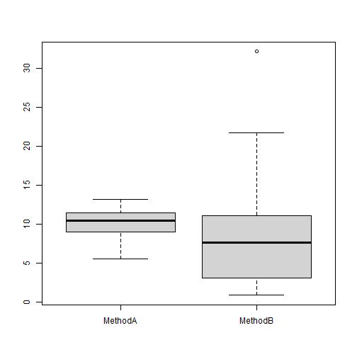

Considere dois métodos A e B, onde desejamos comparar os seus desempenhos.


``` r
#dado sintético 
set.seed(1)
trials <- 30
MethodA <- rnorm(trials, mean=10, sd = 2)
MethodB <- rexp(trials, rate = 1/10)
```


``` r
data <- data.frame(MethodA, MethodB)
head(data)
```

```
##     MethodA   MethodB
## 1  8.747092  2.035104
## 2 10.367287 10.227259
## 3  8.328743  3.017409
## 4 13.190562  7.252143
## 5 10.659016  7.515427
## 6  8.359063  2.350275
```

``` r
boxplot(data)
```



Realizando teste de normalidade usando Shapiro-Wilk

Hipotese nula: não há evidência que a distribuição não seja normal (p-value >= 0.05)

Hipotese alternativa: a distribuição não é normal (p-value < 0.05)


``` r
shapiro.test(MethodA)
```

```
## 
## 	Shapiro-Wilk normality test
## 
## data:  MethodA
## W = 0.95011, p-value = 0.1703
```


``` r
shapiro.test(MethodB)
```

```
## 
## 	Shapiro-Wilk normality test
## 
## data:  MethodB
## W = 0.86506, p-value = 0.001303
```

Realizando um segundo teste de usando Anderson-Darling


``` r
has_nortest <- requireNamespace("nortest", quietly = TRUE)
if (!has_nortest) {
  message("Pacote 'nortest' nao instalado; teste Anderson-Darling sera omitido.")
}
```

```
## Pacote 'nortest' nao instalado; teste Anderson-Darling sera omitido.
```


``` r
if (has_nortest) {
  nortest::ad.test(MethodA)
} else {
  "Teste Anderson-Darling indisponivel sem o pacote 'nortest'."
}
```

```
## [1] "Teste Anderson-Darling indisponivel sem o pacote 'nortest'."
```


``` r
if (has_nortest) {
  nortest::ad.test(MethodB)
} else {
  "Teste Anderson-Darling indisponivel sem o pacote 'nortest'."
}
```

```
## [1] "Teste Anderson-Darling indisponivel sem o pacote 'nortest'."
```

Uma vez não sendo normal, deve-se aplicar o wilcox test.

A hipótese nula é que não evidência de diferença entre A e B (p-value >= 0.05)

A hipótese alternativa há diferença entre A e B (p-value < 0.05)


Novamente há duas situações. 

Situação #1: A primeira é quando se quer comparar a média de A e B. Neste caso a comparação é das amostras. 


``` r
res <- wilcox.test(MethodA, MethodB, paired=FALSE, exact=FALSE)
res
```

```
## 
## 	Wilcoxon rank sum test with continuity correction
## 
## data:  MethodA and MethodB
## W = 580, p-value = 0.05555
## alternative hypothesis: true location shift is not equal to 0
```

Situação #2: Se quer comparar se as medidas individuais de A e B. Neste caso a comparação é pareada. 


``` r
res <- wilcox.test(MethodA, MethodB, paired=TRUE)
res
```

```
## 
## 	Wilcoxon signed rank exact test
## 
## data:  MethodA and MethodB
## V = 314, p-value = 0.0961
## alternative hypothesis: true location shift is not equal to 0
```

Execute este mesmo experimento com menos tentativas (trials) (5, 10)

