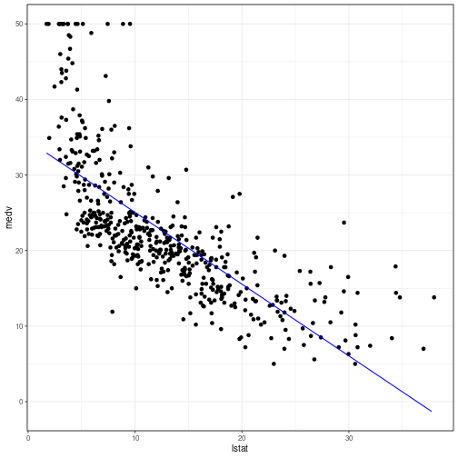
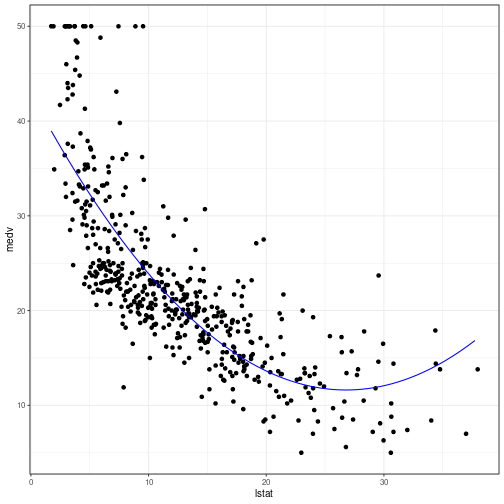

# Regression


```r
# DAL ToolBox
# version 1.0.77


library(daltoolbox)
```

```
## Registered S3 method overwritten by 'quantmod':
##   method            from
##   as.zoo.data.frame zoo
```

```
## 
## Attaching package: 'daltoolbox'
```

```
## The following object is masked from 'package:base':
## 
##     transform
```

```r
library(MASS)
library(plotly)
```

```
## Loading required package: ggplot2
```

```
## 
## Attaching package: 'plotly'
```

```
## The following object is masked from 'package:ggplot2':
## 
##     last_plot
```

```
## The following object is masked from 'package:MASS':
## 
##     select
```

```
## The following object is masked from 'package:stats':
## 
##     filter
```

```
## The following object is masked from 'package:graphics':
## 
##     layout
```

```r
library(reshape2)
```

## Dataset
Both independent and dependent variables are numeric. 


```r
head(Boston)
```

```
##      crim zn indus chas   nox    rm  age    dis rad tax ptratio  black lstat medv
## 1 0.00632 18  2.31    0 0.538 6.575 65.2 4.0900   1 296    15.3 396.90  4.98 24.0
## 2 0.02731  0  7.07    0 0.469 6.421 78.9 4.9671   2 242    17.8 396.90  9.14 21.6
## 3 0.02729  0  7.07    0 0.469 7.185 61.1 4.9671   2 242    17.8 392.83  4.03 34.7
## 4 0.03237  0  2.18    0 0.458 6.998 45.8 6.0622   3 222    18.7 394.63  2.94 33.4
## 5 0.06905  0  2.18    0 0.458 7.147 54.2 6.0622   3 222    18.7 396.90  5.33 36.2
## 6 0.02985  0  2.18    0 0.458 6.430 58.7 6.0622   3 222    18.7 394.12  5.21 28.7
```

## Fitting a first model
Explaining house price using lower status population variable.

$lm$ builds the model.

$summary$ describes the significance of the built model.


```r
lm.fit = lm(medv ~ lstat, data = Boston)

summary(lm.fit)
```

```
## 
## Call:
## lm(formula = medv ~ lstat, data = Boston)
## 
## Residuals:
##     Min      1Q  Median      3Q     Max 
## -15.168  -3.990  -1.318   2.034  24.500 
## 
## Coefficients:
##             Estimate Std. Error t value Pr(>|t|)    
## (Intercept) 34.55384    0.56263   61.41   <2e-16 ***
## lstat       -0.95005    0.03873  -24.53   <2e-16 ***
## ---
## Signif. codes:  0 '***' 0.001 '**' 0.01 '*' 0.05 '.' 0.1 ' ' 1
## 
## Residual standard error: 6.216 on 504 degrees of freedom
## Multiple R-squared:  0.5441,	Adjusted R-squared:  0.5432 
## F-statistic: 601.6 on 1 and 504 DF,  p-value: < 2.2e-16
```

## prediction
The $predict$ function makes predictions from the adjusted model.

The predictions can be presented with either $confidence$ and $prediction$ intervals. 

These intervals can be analyzed at https://statisticsbyjim.com/hypothesis-testing/confidence-prediction-tolerance-intervals/


```r
predict(lm.fit, data.frame(lstat =(c(5, 10, 15))), interval = "confidence")
```

```
##        fit      lwr      upr
## 1 29.80359 29.00741 30.59978
## 2 25.05335 24.47413 25.63256
## 3 20.30310 19.73159 20.87461
```

```r
predict(lm.fit, data.frame(lstat =(c(5, 10, 15))), interval = "prediction")
```

```
##        fit       lwr      upr
## 1 29.80359 17.565675 42.04151
## 2 25.05335 12.827626 37.27907
## 3 20.30310  8.077742 32.52846
```

## Plotting the regression model

It is a good practice to plot the regression model. It enables us to have a feeling of its quality.


```r
axis_x <- seq(min(Boston$lstat), max(Boston$lstat), by = 0.5)
axis_y <- predict(lm.fit, data.frame(lstat=axis_x))

data_adj = data.frame(lstat=axis_x, medv=axis_y)

ggplot(Boston) + geom_point(aes(x = lstat, y = medv)) + geom_line(data=data_adj,aes(x=lstat,y=medv), color="Blue") + theme_bw(base_size = 10) 
```



# Polynomial regression

It is possible to introduce polynomial dimensions of independent data. 


```r
lm.fit_p =lm(medv~lstat+I(lstat^2), data=Boston)
summary (lm.fit_p)
```

```
## 
## Call:
## lm(formula = medv ~ lstat + I(lstat^2), data = Boston)
## 
## Residuals:
##      Min       1Q   Median       3Q      Max 
## -15.2834  -3.8313  -0.5295   2.3095  25.4148 
## 
## Coefficients:
##              Estimate Std. Error t value Pr(>|t|)    
## (Intercept) 42.862007   0.872084   49.15   <2e-16 ***
## lstat       -2.332821   0.123803  -18.84   <2e-16 ***
## I(lstat^2)   0.043547   0.003745   11.63   <2e-16 ***
## ---
## Signif. codes:  0 '***' 0.001 '**' 0.01 '*' 0.05 '.' 0.1 ' ' 1
## 
## Residual standard error: 5.524 on 503 degrees of freedom
## Multiple R-squared:  0.6407,	Adjusted R-squared:  0.6393 
## F-statistic: 448.5 on 2 and 503 DF,  p-value: < 2.2e-16
```

## Plotting the polynomial regression model

It seems to be better adjusted with the data. Is it significant?


```r
axis_x <- seq(min(Boston$lstat), max(Boston$lstat), by = 0.5)
axis_x2 <- axis_x^2
axis_y <- predict(lm.fit_p, data.frame(lstat=axis_x, `I(lstat^2)`=axis_x2))


data_adj = data.frame(lstat=axis_x, medv=axis_y)
ggplot(Boston) + geom_point(aes(x = lstat, y = medv)) + geom_line(data=data_adj,aes(x=lstat,y=medv), color="Blue") + theme_bw(base_size = 10) 
```



## ANOVA test

It is possible to check if a built model is significantly better than another model using the ANOVA test. 

The null hypothesis is that both models are not different ($\operatorname{p-value} > 5\%$). The alternative hypothesis says that they are different ($\operatorname{p-value} < 5\%$). 


```r
anova(lm.fit, lm.fit_p)
```

```
## Analysis of Variance Table
## 
## Model 1: medv ~ lstat
## Model 2: medv ~ lstat + I(lstat^2)
##   Res.Df   RSS Df Sum of Sq     F    Pr(>F)    
## 1    504 19472                                 
## 2    503 15347  1    4125.1 135.2 < 2.2e-16 ***
## ---
## Signif. codes:  0 '***' 0.001 '**' 0.01 '*' 0.05 '.' 0.1 ' ' 1
```

# Multiple regression

It is possible to use more than one dimension as independent data for the regression model. 


```r
lm.fit2 =lm(medv~lstat+age, data=Boston)
summary (lm.fit2)
```

```
## 
## Call:
## lm(formula = medv ~ lstat + age, data = Boston)
## 
## Residuals:
##     Min      1Q  Median      3Q     Max 
## -15.981  -3.978  -1.283   1.968  23.158 
## 
## Coefficients:
##             Estimate Std. Error t value Pr(>|t|)    
## (Intercept) 33.22276    0.73085  45.458  < 2e-16 ***
## lstat       -1.03207    0.04819 -21.416  < 2e-16 ***
## age          0.03454    0.01223   2.826  0.00491 ** 
## ---
## Signif. codes:  0 '***' 0.001 '**' 0.01 '*' 0.05 '.' 0.1 ' ' 1
## 
## Residual standard error: 6.173 on 503 degrees of freedom
## Multiple R-squared:  0.5513,	Adjusted R-squared:  0.5495 
## F-statistic:   309 on 2 and 503 DF,  p-value: < 2.2e-16
```

## Checking the significance of the model


```r
anova(lm.fit ,lm.fit2)
```

```
## Analysis of Variance Table
## 
## Model 1: medv ~ lstat
## Model 2: medv ~ lstat + age
##   Res.Df   RSS Df Sum of Sq     F   Pr(>F)   
## 1    504 19472                               
## 2    503 19168  1    304.25 7.984 0.004907 **
## ---
## Signif. codes:  0 '***' 0.001 '**' 0.01 '*' 0.05 '.' 0.1 ' ' 1
```

# Logistic Regression
In this example the predicted dependent variable is categorical.


```r
head(iris)
```

```
##   Sepal.Length Sepal.Width Petal.Length Petal.Width Species
## 1          5.1         3.5          1.4         0.2  setosa
## 2          4.9         3.0          1.4         0.2  setosa
## 3          4.7         3.2          1.3         0.2  setosa
## 4          4.6         3.1          1.5         0.2  setosa
## 5          5.0         3.6          1.4         0.2  setosa
## 6          5.4         3.9          1.7         0.4  setosa
```

To make the problem simpler, let us assume that we intend to predict if a species is $versicolor$ or if it is $other$ species. 


```r
data <- iris
data$versicolor <- as.integer(data$Species=="versicolor")
data$Species <- c('other', 'versicolor')[data$versicolor+1]
```

Using preprocessing functions, we separate both training and test data. 


```r
tt <- daltoolbox::train_test(daltoolbox::sample_random(), data)
train <- tt$train
test <- tt$test
head(train)
```

```
##     Sepal.Length Sepal.Width Petal.Length Petal.Width    Species versicolor
## 42           4.5         2.3          1.3         0.3      other          0
## 5            5.0         3.6          1.4         0.2      other          0
## 122          5.6         2.8          4.9         2.0      other          0
## 26           5.0         3.0          1.6         0.2      other          0
## 66           6.7         3.1          4.4         1.4 versicolor          1
## 4            4.6         3.1          1.5         0.2      other          0
```

This dataset is unbalanced using this perspective. If the prediction for $versicolor$ is higher than its probability, it can be classified as $versicolor$. 


```r
t <- mean(train$versicolor)
print(t)
```

```
## [1] 0.35
```

The creation of the logistic regression model using all independent variables uses $glm$ function.


```r
pred <- glm(versicolor ~ .-Species, data=train, family = binomial)
```

The quality of adjustment using training data is measured using the confusion table. 


```r
res <- predict(pred, train, type="response")
res <- as.integer(res >= t)
table(res, train$versicolor)
```

```
##    
## res  0  1
##   0 56 11
##   1 22 31
```

The quality of prediction using the test data is measured using the confusion table. 


```r
res <- predict(pred, test, type="response")
res <- res >= t
table(res, test$versicolor)
```

```
##        
## res      0  1
##   FALSE 15  1
##   TRUE   7  7
```

Creation of the logistic regression model using the independent variables with lower entropy during binning transformation.  


```r
pred <- glm(versicolor ~ Petal.Length + Petal.Width, data=train, family = binomial)
```

The quality of adjustment using training data is measured using the confusion table. 


```r
res <- predict(pred, train, type="response")
res <- as.integer(res >= t)
table(res, train$versicolor)
```

```
##    
## res  0  1
##   0 61  8
##   1 17 34
```

The quality of prediction using the test data is measured using the confusion table. 


```r
res <- predict(pred, test, type="response")
res <- as.integer(res >= t)
table(res, test$versicolor)
```

```
##    
## res  0  1
##   0 15  0
##   1  7  8
```

