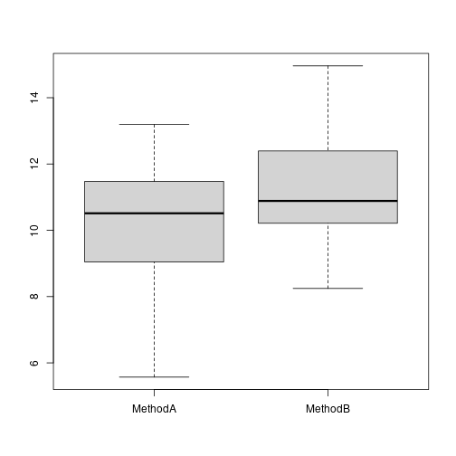

Considere dois métodos A e B, onde desejamos comparar os seus desempenhos.


```r
#dado sintético 
set.seed(1)
trials <- 30
MethodA <- rnorm(trials, mean=10, sd = 2)
MethodB <- rnorm(trials, mean=11, sd = 2)
```


```r
data <- data.frame(MethodA, MethodB)
head(data)
```

```
##     MethodA   MethodB
## 1  8.747092 13.717359
## 2 10.367287 10.794425
## 3  8.328743 11.775343
## 4 13.190562 10.892390
## 5 10.659016  8.245881
## 6  8.359063 10.170011
```

```r
boxplot(data)
```




```r
res <- wilcox.test(MethodA, MethodB, paired=TRUE, exact=FALSE)
res
```

```
## 
## 	Wilcoxon signed rank test with continuity correction
## 
## data:  MethodA and MethodB
## V = 129, p-value = 0.03413
## alternative hypothesis: true location shift is not equal to 0
```

Análise do Effect Size


```r
library(rstatix)
```

Execute este mesmo experimento com menos tentativas (trials) (5, 10)


```r
methods = c(rep("MethodA", length(MethodA)), rep("MethodB", length(MethodB)))
data_effect = data.frame(methods, y = c(MethodA, MethodB))
```


```r
wilcox_effsize(y ~ methods, paired=TRUE, data=data_effect)
```

```
## # A tibble: 1 × 7
##   .y.   group1  group2  effsize    n1    n2 magnitude
## * <chr> <chr>   <chr>     <dbl> <int> <int> <ord>    
## 1 y     MethodA MethodB   0.389    30    30 moderate
```

Altere as médias para avaliar a magnitude do efeito.

