# Exploratory analysis
A brief exploratory analysis example. 

### Iris datasets
The exploratory analysis is done using iris dataset.


```r
colors <- brewer.pal(4, 'Set1')
font <- theme(text = element_text(size=16))
```


```r
# DAL ToolBox
# version 1.0.77


library(daltoolbox)
library(ggplot2)
library(dplyr)
library(reshape)
library(RColorBrewer)
library(corrplot)
library(WVPlots)
library(GGally)
library(aplpack)

source("https://raw.githubusercontent.com/eogasawara/mylibrary/master/tutorial/graphics_extra.R")
```

```
## Warning in file(filename, "r", encoding = encoding): cannot open URL
## 'https://raw.githubusercontent.com/eogasawara/mylibrary/master/tutorial/graphics_extra.R': HTTP status was '404 Not Found'
```

```
## Error in file(filename, "r", encoding = encoding): cannot open the connection to 'https://raw.githubusercontent.com/eogasawara/mylibrary/master/tutorial/graphics_extra.R'
```

## Part 1


```r
library(MASS)
data(iris)
```


```r
head(iris[c(1:3,51:53,101:103),])
```

```
##    Sepal.Length Sepal.Width Petal.Length Petal.Width    Species
## 1           5.1         3.5          1.4         0.2     setosa
## 2           4.9         3.0          1.4         0.2     setosa
## 3           4.7         3.2          1.3         0.2     setosa
## 51          7.0         3.2          4.7         1.4 versicolor
## 52          6.4         3.2          4.5         1.5 versicolor
## 53          6.9         3.1          4.9         1.5 versicolor
```

### Data Summary
A preliminary analysis using the $Sepal.Length$ attribute. 

This should be done for all attributes. 


```r
sum <- summary(iris$Sepal.Length)
sum
```

```
##    Min. 1st Qu.  Median    Mean 3rd Qu.    Max. 
##   4.300   5.100   5.800   5.843   6.400   7.900
```


```r
IQR <- sum["3rd Qu."]-sum["1st Qu."]
print(sprintf("IQR=%.1f", IQR))
```

```
## [1] "IQR=1.3"
```

## Part 2


```r
options(repr.plot.width=4, repr.plot.height=4)
```

### Histogram analysis


```r
grf <- plot_hist(iris %>% dplyr::select(Sepal.Length), 
          label_x = "Sepal Length", color=colors[1]) + font
```

```
## Using  as id variables
```

```r
plot(grf)
```

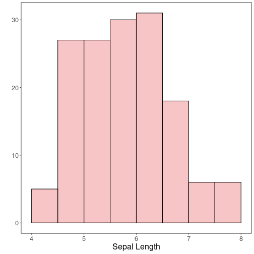

Grouping graphics


```r
grf1 <- plot_hist(iris %>% dplyr::select(Sepal.Length), 
                  label_x = "Sepal.Length", color=colors[1]) + font
```

```
## Using  as id variables
```

```r
grf2 <- plot_hist(iris %>% dplyr::select(Sepal.Width), 
                  label_x = "Sepal.Width", color=colors[1]) + font  
```

```
## Using  as id variables
```

```r
grf3 <- plot_hist(iris %>% dplyr::select(Petal.Length), 
                  label_x = "Petal.Length", color=colors[1]) + font 
```

```
## Using  as id variables
```

```r
grf4 <- plot_hist(iris %>% dplyr::select(Petal.Width), 
                  label_x = "Petal.Width", color=colors[1]) + font
```

```
## Using  as id variables
```

```r
load_library("gridExtra") 
```

```
## Error in load_library("gridExtra"): could not find function "load_library"
```

```r
options(repr.plot.width=16, repr.plot.height=4)
grid.arrange(grf1, grf2, grf3, grf4, ncol=4)
```

```
## Error in grid.arrange(grf1, grf2, grf3, grf4, ncol = 4): could not find function "grid.arrange"
```

```r
options(repr.plot.width=4, repr.plot.height=4)
```

### Density distribution


```r
grf1 <- plot_density(iris %>% dplyr::select(Sepal.Length), 
                  label_x = "Sepal.Length", color=colors[1]) + font
```

```
## Using  as id variables
```

```r
grf2 <- plot_density(iris %>% dplyr::select(Sepal.Width), 
                  label_x = "Sepal.Width", color=colors[1]) + font  
```

```
## Using  as id variables
```

```r
grf3 <- plot_density(iris %>% dplyr::select(Petal.Length), 
                  label_x = "Petal.Length", color=colors[1]) + font 
```

```
## Using  as id variables
```

```r
grf4 <- plot_density(iris %>% dplyr::select(Petal.Width), 
                  label_x = "Petal.Width", color=colors[1]) + font
```

```
## Using  as id variables
```

```r
options(repr.plot.width=16, repr.plot.height=4)
grid.arrange(grf1, grf2, grf3, grf4, ncol=4)
```

```
## Error in grid.arrange(grf1, grf2, grf3, grf4, ncol = 4): could not find function "grid.arrange"
```

```r
options(repr.plot.width=5, repr.plot.height=4)
```

### Box-plot analysis


```r
grf <- plot_boxplot(iris, colors=colors[1]) + font
```

```
## Using Species as id variables
```

```r
plot(grf)
```

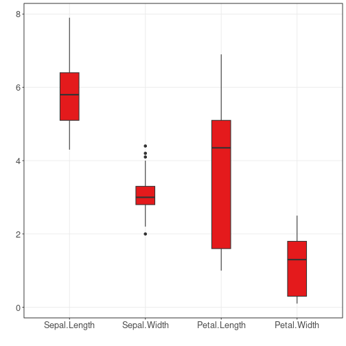

### Consider the classification problem targeting to predict the species

### Density distribution colored by the classifier


```r
grfA <- plot_density_class(iris %>% dplyr::select(Species, Sepal.Length), 
            class_label="Species", label_x = "Sepal.Length", color=colors[c(1:3)]) + font
grfB <- plot_density_class(iris %>% dplyr::select(Species, Sepal.Width), 
            class_label="Species", label_x = "Sepal.Width", color=colors[c(1:3)]) + font
grfC <- plot_density_class(iris %>% dplyr::select(Species, Petal.Length), 
            class_label="Species", label_x = "Petal.Length", color=colors[c(1:3)]) + font
grfD <- plot_density_class(iris %>% dplyr::select(Species, Petal.Width), 
            class_label="Species", label_x = "Petal.Width", color=colors[c(1:3)]) + font

options(repr.plot.width=8, repr.plot.height=8)
grid.arrange(grfA, grfB, grfC, grfD, ncol=2, nrow=2)
```

```
## Error in grid.arrange(grfA, grfB, grfC, grfD, ncol = 2, nrow = 2): could not find function "grid.arrange"
```

```r
options(repr.plot.width=4, repr.plot.height=4)
```

### Box-plot analysis grouped by the classifier


```r
grfA <- plot_boxplot_class(iris %>% dplyr::select(Species, Sepal.Length), 
          class_label="Species", label_x = "Sepal.Length", color=colors[c(1:3)]) + font
grfB <- plot_boxplot_class(iris %>% dplyr::select(Species, Sepal.Width), 
          class_label="Species", label_x = "Sepal.Width", color=colors[c(1:3)]) + font
grfC <- plot_boxplot_class(iris %>% dplyr::select(Species, Petal.Length), 
          class_label="Species", label_x = "Petal.Length", color=colors[c(1:3)]) + font
grfD <- plot_boxplot_class(iris %>% dplyr::select(Species, Petal.Width), 
          class_label="Species", label_x = "Petal.Width", color=colors[c(1:3)]) + font

options(repr.plot.width=8, repr.plot.height=8)
grid.arrange(grfA, grfB, grfC, grfD, ncol=2, nrow=2)
```

```
## Error in grid.arrange(grfA, grfB, grfC, grfD, ncol = 2, nrow = 2): could not find function "grid.arrange"
```

```r
options(repr.plot.width=5, repr.plot.height=4)
```

## Part 3

### Scatter plot


```r
grf <- plot_scatter(iris |> dplyr::select(x=Sepal.Length, value=Sepal.Width) |> mutate(variable = "iris"), 
                    label_x = "Sepal.Length", 
                    label_y = "Sepal.Width", colors=colors[1]) +
                    theme(legend.position = "none") + font
```

```
## Scale for colour is already present.
## Adding another scale for colour, which will replace the existing scale.
```

```r
plot(grf)
```

```
## Error in `train_continuous()`:
## ! Discrete value supplied to a continuous scale
```


```r
grf <- plot_scatter(iris |> dplyr::select(x = Sepal.Length, value = Sepal.Width, variable = Species), 
                    label_x = "Sepal.Length", label_y = "Sepal.Width", colors=colors[1:3]) + font

plot(grf)
```

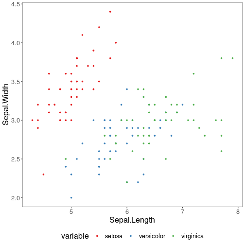

### Correlation matrix


```r
grf <- plot_correlation(iris %>% 
                 dplyr::select(Sepal.Width, Sepal.Length, Petal.Width, Petal.Length))
```

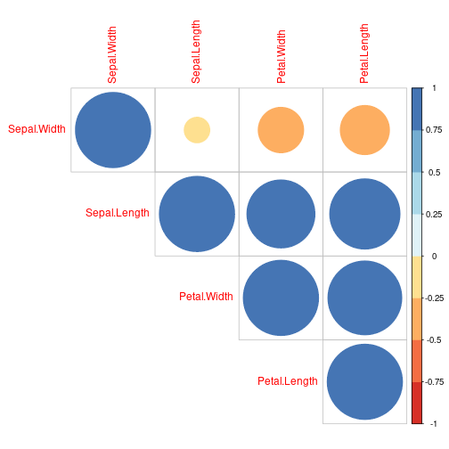

```r
options(repr.plot.width=8, repr.plot.height=8)
grf
```

```
## $corr
##              Sepal.Width Sepal.Length Petal.Width Petal.Length
## Sepal.Width    1.0000000   -0.1175698  -0.3661259   -0.4284401
## Sepal.Length  -0.1175698    1.0000000   0.8179411    0.8717538
## Petal.Width   -0.3661259    0.8179411   1.0000000    0.9628654
## Petal.Length  -0.4284401    0.8717538   0.9628654    1.0000000
## 
## $corrPos
##           xName        yName x y       corr
## 1   Sepal.Width  Sepal.Width 1 4  1.0000000
## 2  Sepal.Length  Sepal.Width 2 4 -0.1175698
## 3  Sepal.Length Sepal.Length 2 3  1.0000000
## 4   Petal.Width  Sepal.Width 3 4 -0.3661259
## 5   Petal.Width Sepal.Length 3 3  0.8179411
## 6   Petal.Width  Petal.Width 3 2  1.0000000
## 7  Petal.Length  Sepal.Width 4 4 -0.4284401
## 8  Petal.Length Sepal.Length 4 3  0.8717538
## 9  Petal.Length  Petal.Width 4 2  0.9628654
## 10 Petal.Length Petal.Length 4 1  1.0000000
## 
## $arg
## $arg$type
## [1] "upper"
```

```r
options(repr.plot.width=4, repr.plot.height=4)
```

## Matrix dispersion


```r
grf <- plot_pair(data=iris, cnames=colnames(iris)[1:4], 
                 title="Iris", colors=colors[1])

options(repr.plot.width=10, repr.plot.height=10)
plot(grf)
```

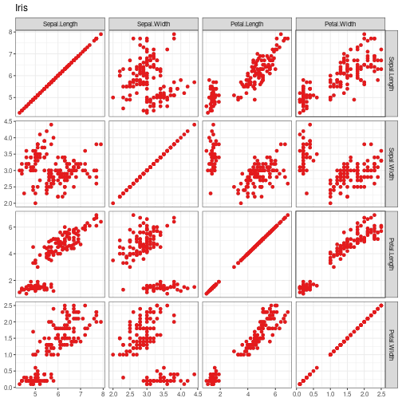

```r
options(repr.plot.width=4, repr.plot.height=4)
```

## Matrix dispersion by the classifier


```r
grf <- plot_pair(data=iris, cnames=colnames(iris)[1:4], 
                 clabel='Species', title="Iris", colors=colors[1:3])
options(repr.plot.width=10, repr.plot.height=10)
plot(grf)
```

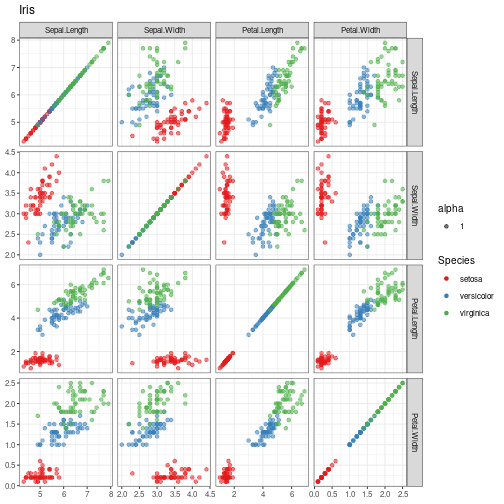

```r
options(repr.plot.width=4, repr.plot.height=4)
```

## Advanced matrix dispersion


```r
grf <- plot_pair_adv(data=iris, cnames=colnames(iris)[1:4], 
                     title="Iris", colors=colors[1])
options(repr.plot.width=10, repr.plot.height=10)
grf
```

```
## plot: [1, 1] [=======>-----------------------------------------------------------------------------------------------------------------] 6% est: 0s
## plot: [1, 2] [==============>----------------------------------------------------------------------------------------------------------] 12% est: 0s
## plot: [1, 3] [======================>--------------------------------------------------------------------------------------------------] 19% est: 1s
## plot: [1, 4] [=============================>-------------------------------------------------------------------------------------------] 25% est: 1s
## plot: [2, 1] [=====================================>-----------------------------------------------------------------------------------] 31% est: 1s
## plot: [2, 2] [============================================>----------------------------------------------------------------------------] 38% est: 1s
## plot: [2, 3] [====================================================>--------------------------------------------------------------------] 44% est: 1s
## plot: [2, 4] [===========================================================>-------------------------------------------------------------] 50% est: 1s
## plot: [3, 1] [===================================================================>-----------------------------------------------------] 56% est: 1s
## plot: [3, 2] [===========================================================================>---------------------------------------------] 62% est: 0s
## plot: [3, 3] [==================================================================================>--------------------------------------] 69% est: 0s
## plot: [3, 4] [==========================================================================================>------------------------------] 75% est: 0s
## plot: [4, 1] [=================================================================================================>-----------------------] 81% est: 0s
## plot: [4, 2] [=========================================================================================================>---------------] 88% est: 0s
## plot: [4, 3] [================================================================================================================>--------] 94% est: 0s
## plot: [4, 4] [=========================================================================================================================]100% est: 0s
```

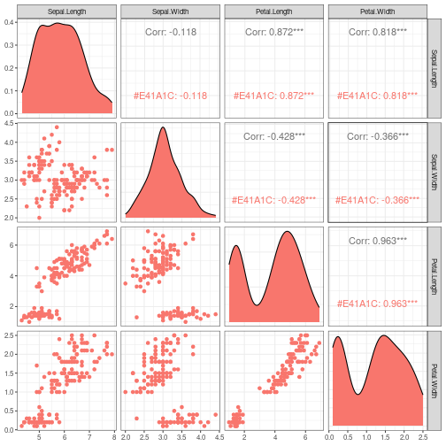

```r
options(repr.plot.width=4, repr.plot.height=4)
```

## Advanced matrix dispersion with the classifier


```r
grf <- plot_pair_adv(data=iris, cnames=colnames(iris)[1:4], 
                        title="Iris", clabel='Species', colors=colors[1:3])
options(repr.plot.width=10, repr.plot.height=10)
grf
```

```
## plot: [1, 1] [====>--------------------------------------------------------------------------------------------------------------------] 4% est: 0s
## plot: [1, 2] [=========>---------------------------------------------------------------------------------------------------------------] 8% est: 1s
## plot: [1, 3] [==============>----------------------------------------------------------------------------------------------------------] 12% est: 1s
## plot: [1, 4] [==================>------------------------------------------------------------------------------------------------------] 16% est: 2s
## plot: [1, 5] [=======================>-------------------------------------------------------------------------------------------------] 20% est: 2s
## plot: [2, 1] [============================>--------------------------------------------------------------------------------------------] 24% est: 2s
## plot: [2, 2] [=================================>---------------------------------------------------------------------------------------] 28% est: 2s
## plot: [2, 3] [======================================>----------------------------------------------------------------------------------] 32% est: 2s
## plot: [2, 4] [===========================================>-----------------------------------------------------------------------------] 36% est: 1s
## plot: [2, 5] [===============================================>-------------------------------------------------------------------------] 40% est: 1s
## plot: [3, 1] [====================================================>--------------------------------------------------------------------] 44% est: 1s
## plot: [3, 2] [=========================================================>---------------------------------------------------------------] 48% est: 1s
## plot: [3, 3] [==============================================================>----------------------------------------------------------] 52% est: 1s
## plot: [3, 4] [===================================================================>-----------------------------------------------------] 56% est: 1s
## plot: [3, 5] [========================================================================>------------------------------------------------] 60% est: 1s
## plot: [4, 1] [============================================================================>--------------------------------------------] 64% est: 1s
## plot: [4, 2] [=================================================================================>---------------------------------------] 68% est: 1s
## plot: [4, 3] [======================================================================================>----------------------------------] 72% est: 1s
## plot: [4, 4] [===========================================================================================>-----------------------------] 76% est: 0s
## plot: [4, 5] [================================================================================================>------------------------] 80% est: 0s
## plot: [5, 1] [=====================================================================================================>-------------------] 84% est: 0s
## `stat_bin()` using `bins = 30`. Pick better value with `binwidth`.
 plot: [5, 2]
## [=========================================================================================================>---------------] 88% est: 0s `stat_bin()`
## using `bins = 30`. Pick better value with `binwidth`.
 plot: [5, 3]
## [==============================================================================================================>----------] 92% est: 0s `stat_bin()`
## using `bins = 30`. Pick better value with `binwidth`.
 plot: [5, 4]
## [===================================================================================================================>-----] 96% est: 0s `stat_bin()`
## using `bins = 30`. Pick better value with `binwidth`.
 plot: [5, 5]
## [=========================================================================================================================]100% est: 0s
```

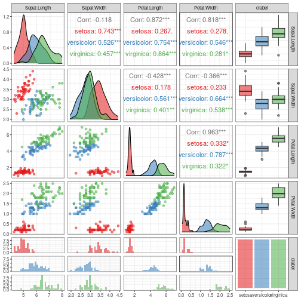

```r
options(repr.plot.width=4, repr.plot.height=4)
```

## Parallel coordinates


```r
grf <- ggparcoord(data = iris, columns = c(1:4), group=5) + 
    theme_bw(base_size = 10) + scale_color_manual(values=colors[1:3]) + font

options(repr.plot.width=10, repr.plot.height=5)
plot(grf)
```

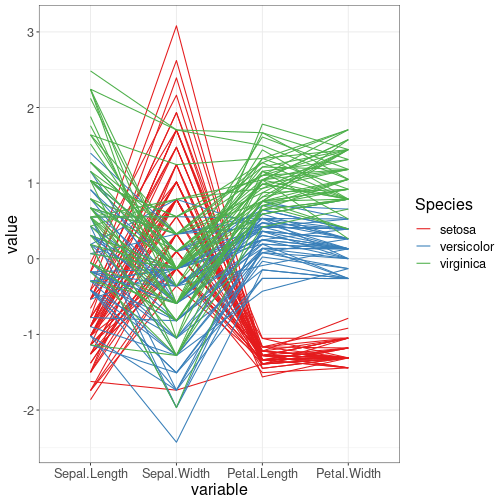

```r
options(repr.plot.width=4, repr.plot.height=4)
```

## Images


```r
mat <- as.matrix(iris[,1:4])
x <- (1:nrow(mat))
y <- (1:ncol(mat))

options(repr.plot.width=12, repr.plot.height=5)
image(x, y, mat, col = brewer.pal(11, 'Spectral'), axes = FALSE,  
      main = "Iris", xlab="sample", ylab="Attributes")
axis(2, at = seq(0, ncol(mat), by = 1))
axis(1, at = seq(0, nrow(mat), by = 10))
```

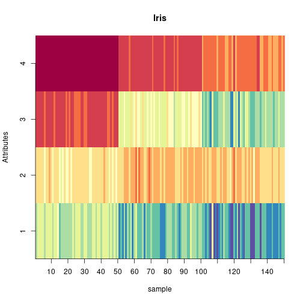

```r
options(repr.plot.width=4, repr.plot.height=4)
```

## Chernoff faces


```r
set.seed(1)
sample_rows = sample(1:nrow(iris), 25)

isample = iris[sample_rows,]
labels = as.character(rownames(isample))
isample$Species <- NULL

options(repr.plot.width=12, repr.plot.height=12)
faces(isample, labels = labels, print.info=F, cex=1)
```

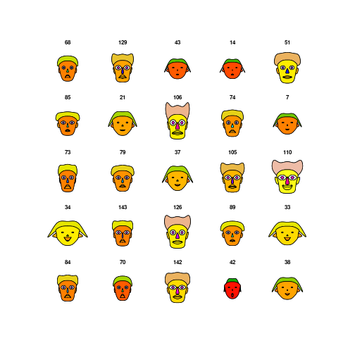

```r
options(repr.plot.width=4, repr.plot.height=4)
```

## Chernoff faces with the classifier


```r
set.seed(1)
sample_rows = sample(1:nrow(iris), 25)

isample = iris[sample_rows,]
labels = as.character(isample$Species)
isample$Species <- NULL

options(repr.plot.width=12, repr.plot.height=12)
faces(isample, labels = labels, print.info=F, cex=1)
```

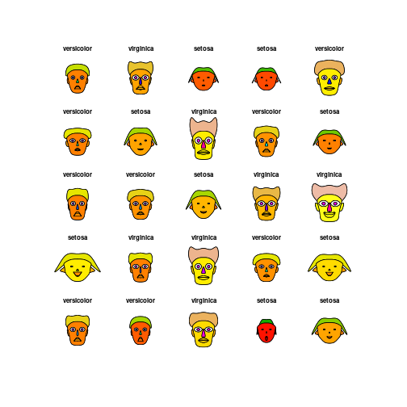

```r
options(repr.plot.width=4, repr.plot.height=4)
```

