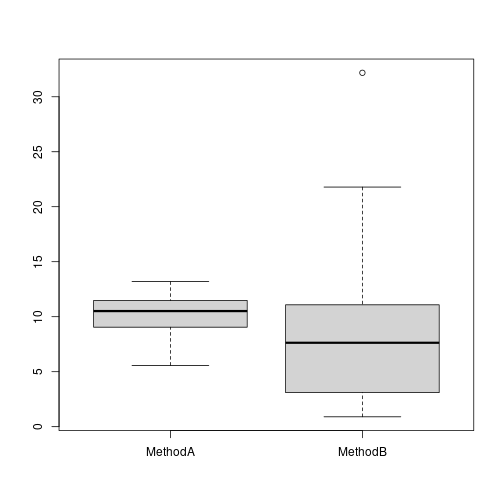

Considere dois métodos A e B, onde desejamos comparar os seus desempenhos.


```r
#dado sintético 
set.seed(1)
trials <- 30
MethodA <- rnorm(trials, mean=10, sd = 2)
MethodB <- rexp(trials, rate = 1/10)
```


```r
data <- data.frame(MethodA, MethodB)
head(data)
```

```
##     MethodA   MethodB
## 1  8.747092  2.035104
## 2 10.367287 10.227259
## 3  8.328743  3.017409
## 4 13.190562  7.252143
## 5 10.659016  7.515427
## 6  8.359063  2.350275
```

```r
boxplot(data)
```



Realizando teste de normalidade usando Shapiro-Wilk

Hipotese nula: não há evidência que a distribuição não seja normal (p-value >= 0.05)

Hipotese alternativa: a distribuição não é normal (p-value < 0.05)


```r
shapiro.test(MethodA)
```

```
## 
## 	Shapiro-Wilk normality test
## 
## data:  MethodA
## W = 0.95011, p-value = 0.1703
```


```r
shapiro.test(MethodB)
```

```
## 
## 	Shapiro-Wilk normality test
## 
## data:  MethodB
## W = 0.86506, p-value = 0.001303
```

Realizando um segundo teste de usando Anderson-Darling


```r
library(nortest)
```


```r
ad.test(MethodA)
```

```
## 
## 	Anderson-Darling normality test
## 
## data:  MethodA
## A = 0.48213, p-value = 0.2142
```


```r
ad.test(MethodB)
```

```
## 
## 	Anderson-Darling normality test
## 
## data:  MethodB
## A = 1.0281, p-value = 0.008948
```

Uma vez não sendo normal, deve-se aplicar o wilcox test.

A hipótese nula é que não evidência de diferença entre A e B (p-value >= 0.05)

A hipótese alternativa há diferença entre A e B (p-value < 0.05)


Novamente há duas situações. 

Situação #1: A primeira é quando se quer comparar a média de A e B. Neste caso a comparação é das amostras. 


```r
res <- wilcox.test(MethodA, MethodB, paired=FALSE, exact=FALSE)
res
```

```
## 
## 	Wilcoxon rank sum test with continuity correction
## 
## data:  MethodA and MethodB
## W = 580, p-value = 0.05555
## alternative hypothesis: true location shift is not equal to 0
```

Situação #2: Se quer comparar se as medidas individuais de A e B. Neste caso a comparação é pareada. 


```r
res <- t.test(MethodA, MethodB, paired=TRUE)
res
```

```
## 
## 	Paired t-test
## 
## data:  MethodA and MethodB
## t = 0.976, df = 29, p-value = 0.3371
## alternative hypothesis: true mean difference is not equal to 0
## 95 percent confidence interval:
##  -1.303921  3.684384
## sample estimates:
## mean difference 
##        1.190231
```

Execute este mesmo experimento com menos tentativas (trials) (5, 10)

