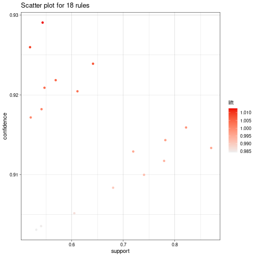
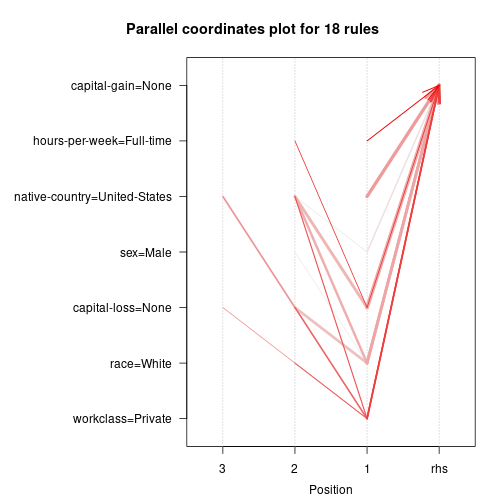

# Pattern Mining
## Library


```r
# DAL ToolBox
# version 1.0.77


library(daltoolbox)

library(arules)
```

```
## Loading required package: Matrix
```

```
## 
## Attaching package: 'arules'
```

```
## The following objects are masked from 'package:base':
## 
##     abbreviate, write
```

```r
library(arulesViz)
library(arulesSequences)
```

```
## 
## Attaching package: 'arulesSequences'
```

```
## The following object is masked from 'package:arules':
## 
##     itemsets
```


```r
data(AdultUCI)
dim(AdultUCI)
```

```
## [1] 48842    15
```

```r
head(AdultUCI)
```

```
##   age        workclass fnlwgt education education-num     marital-status        occupation  relationship  race    sex capital-gain capital-loss
## 1  39        State-gov  77516 Bachelors            13      Never-married      Adm-clerical Not-in-family White   Male         2174            0
## 2  50 Self-emp-not-inc  83311 Bachelors            13 Married-civ-spouse   Exec-managerial       Husband White   Male            0            0
## 3  38          Private 215646   HS-grad             9           Divorced Handlers-cleaners Not-in-family White   Male            0            0
## 4  53          Private 234721      11th             7 Married-civ-spouse Handlers-cleaners       Husband Black   Male            0            0
## 5  28          Private 338409 Bachelors            13 Married-civ-spouse    Prof-specialty          Wife Black Female            0            0
## 6  37          Private 284582   Masters            14 Married-civ-spouse   Exec-managerial          Wife White Female            0            0
##   hours-per-week native-country income
## 1             40  United-States  small
## 2             13  United-States  small
## 3             40  United-States  small
## 4             40  United-States  small
## 5             40           Cuba  small
## 6             40  United-States  small
```

## Removing attributes


```r
AdultUCI$fnlwgt <- NULL
AdultUCI$"education-num" <- NULL
```

## Conceptual Hierarchy and Binning


```r
AdultUCI$age <- ordered(cut(AdultUCI$age, c(15,25,45,65,100)),
                              labels = c("Young", "Middle-aged", "Senior", "Old"))

AdultUCI$"hours-per-week" <- ordered(cut(AdultUCI$"hours-per-week",
                                             c(0,25,40,60,168)),
                                         labels = c("Part-time", "Full-time", "Over-time", "Workaholic"))

AdultUCI$"capital-gain" <- ordered(cut(AdultUCI$"capital-gain",
                                           c(-Inf,0,median(AdultUCI$"capital-gain"[AdultUCI$"capital-gain">0]),
                                             Inf)), labels = c("None", "Low", "High"))

AdultUCI$"capital-loss" <- ordered(cut(AdultUCI$"capital-loss",
                                           c(-Inf,0, median(AdultUCI$"capital-loss"[AdultUCI$"capital-loss">0]),
                                             Inf)), labels = c("None", "Low", "High"))

head(AdultUCI)
```

```
##           age        workclass education     marital-status        occupation  relationship  race    sex capital-gain capital-loss hours-per-week
## 1 Middle-aged        State-gov Bachelors      Never-married      Adm-clerical Not-in-family White   Male          Low         None      Full-time
## 2      Senior Self-emp-not-inc Bachelors Married-civ-spouse   Exec-managerial       Husband White   Male         None         None      Part-time
## 3 Middle-aged          Private   HS-grad           Divorced Handlers-cleaners Not-in-family White   Male         None         None      Full-time
## 4      Senior          Private      11th Married-civ-spouse Handlers-cleaners       Husband Black   Male         None         None      Full-time
## 5 Middle-aged          Private Bachelors Married-civ-spouse    Prof-specialty          Wife Black Female         None         None      Full-time
## 6 Middle-aged          Private   Masters Married-civ-spouse   Exec-managerial          Wife White Female         None         None      Full-time
##   native-country income
## 1  United-States  small
## 2  United-States  small
## 3  United-States  small
## 4  United-States  small
## 5           Cuba  small
## 6  United-States  small
```

## Convert to transactions


```r
AdultTrans <- as(AdultUCI, "transactions")
```

## A Priori


```r
rules <- apriori(AdultTrans, parameter=list(supp = 0.5, conf = 0.9, minlen=2, maxlen= 10, target = "rules"), 
                 appearance=list(rhs = c("capital-gain=None"), default="lhs"), control=NULL)
```

```
## Apriori
## 
## Parameter specification:
##  confidence minval smax arem  aval originalSupport maxtime support minlen maxlen target  ext
##         0.9    0.1    1 none FALSE            TRUE       5     0.5      2     10  rules TRUE
## 
## Algorithmic control:
##  filter tree heap memopt load sort verbose
##     0.1 TRUE TRUE  FALSE TRUE    2    TRUE
## 
## Absolute minimum support count: 24421 
## 
## set item appearances ...[1 item(s)] done [0.00s].
## set transactions ...[115 item(s), 48842 transaction(s)] done [0.03s].
## sorting and recoding items ... [9 item(s)] done [0.00s].
## creating transaction tree ... done [0.01s].
## checking subsets of size 1 2 3 4 done [0.00s].
## writing ... [18 rule(s)] done [0.00s].
## creating S4 object  ... done [0.00s].
```

```r
inspect(rules)
```

```
##      lhs                                                                     rhs                 support   confidence coverage  lift      count
## [1]  {hours-per-week=Full-time}                                           => {capital-gain=None} 0.5435895 0.9290688  0.5850907 1.0127342 26550
## [2]  {sex=Male}                                                           => {capital-gain=None} 0.6050735 0.9051455  0.6684820 0.9866565 29553
## [3]  {workclass=Private}                                                  => {capital-gain=None} 0.6413742 0.9239073  0.6941976 1.0071078 31326
## [4]  {race=White}                                                         => {capital-gain=None} 0.7817862 0.9143240  0.8550428 0.9966616 38184
## [5]  {native-country=United-States}                                       => {capital-gain=None} 0.8219565 0.9159062  0.8974243 0.9983862 40146
## [6]  {capital-loss=None}                                                  => {capital-gain=None} 0.8706646 0.9133376  0.9532779 0.9955863 42525
## [7]  {capital-loss=None, hours-per-week=Full-time}                        => {capital-gain=None} 0.5191638 0.9259787  0.5606650 1.0093657 25357
## [8]  {race=White, sex=Male}                                               => {capital-gain=None} 0.5313050 0.9030799  0.5883256 0.9844048 25950
## [9]  {sex=Male, native-country=United-States}                             => {capital-gain=None} 0.5406003 0.9035349  0.5983170 0.9849008 26404
## [10] {workclass=Private, race=White}                                      => {capital-gain=None} 0.5472339 0.9208931  0.5942427 1.0038221 26728
## [11] {workclass=Private, native-country=United-States}                    => {capital-gain=None} 0.5689570 0.9218444  0.6171942 1.0048592 27789
## [12] {workclass=Private, capital-loss=None}                               => {capital-gain=None} 0.6111748 0.9204465  0.6639982 1.0033354 29851
## [13] {race=White, native-country=United-States}                           => {capital-gain=None} 0.7194628 0.9128933  0.7881127 0.9951019 35140
## [14] {race=White, capital-loss=None}                                      => {capital-gain=None} 0.7404283 0.9099693  0.8136849 0.9919147 36164
## [15] {capital-loss=None, native-country=United-States}                    => {capital-gain=None} 0.7793702 0.9117168  0.8548380 0.9938195 38066
## [16] {workclass=Private, race=White, capital-loss=None}                   => {capital-gain=None} 0.5204742 0.9171628  0.5674829 0.9997559 25421
## [17] {workclass=Private, capital-loss=None, native-country=United-States} => {capital-gain=None} 0.5414807 0.9182030  0.5897179 1.0008898 26447
## [18] {race=White, capital-loss=None, native-country=United-States}        => {capital-gain=None} 0.6803980 0.9083504  0.7490480 0.9901500 33232
```


```r
rules_a <- as(rules, "data.frame")
head(rules_a)
```

```
##                                                   rules   support confidence  coverage      lift count
## 1     {hours-per-week=Full-time} => {capital-gain=None} 0.5435895  0.9290688 0.5850907 1.0127342 26550
## 2                     {sex=Male} => {capital-gain=None} 0.6050735  0.9051455 0.6684820 0.9866565 29553
## 3            {workclass=Private} => {capital-gain=None} 0.6413742  0.9239073 0.6941976 1.0071078 31326
## 4                   {race=White} => {capital-gain=None} 0.7817862  0.9143240 0.8550428 0.9966616 38184
## 5 {native-country=United-States} => {capital-gain=None} 0.8219565  0.9159062 0.8974243 0.9983862 40146
## 6            {capital-loss=None} => {capital-gain=None} 0.8706646  0.9133376 0.9532779 0.9955863 42525
```

## Analysis of Rules


```r
imrules <- interestMeasure(rules, transactions = AdultTrans)
head(imrules)
```

```
##     support confidence      lift count   addedValue boost casualConfidence casualSupport centeredConfidence   certainty chiSquared collectiveStrength
## 1 0.5435895  0.9290688 1.0127342 26550  0.011682156   Inf        0.9999976      1.419475        0.011682156  0.14140765  124.02435          2100.4687
## 2 0.6050735  0.9051455 0.9866565 29553 -0.012241193   Inf        0.9999966      1.459052       -0.012241193 -0.14817456  194.72472           885.1584
## 3 0.6413742  0.9239073 1.0071078 31326  0.006520598   Inf        0.9999973      1.505938        0.006520598  0.07892913   62.20252          1505.6653
## 4 0.7817862  0.9143240 0.9966616 38184 -0.003062649   Inf        0.9999966      1.625916       -0.003062649 -0.03707209   35.65606           444.0500
## 5 0.8219565  0.9159062 0.9983862 40146 -0.001480488   Inf        0.9999966      1.663875       -0.001480488 -0.01792069   12.35817           343.0174
## 6 0.8706646  0.9133376 0.9955863 42525 -0.004049047   Inf        0.9999964      1.705438       -0.004049047 -0.04901203  215.57271             0.0000
##   confirmedConfidence conviction    cosine counterexample  coverage         doc fishersExactTest         gini hyperConfidence hyperLift  imbalance
## 1           0.8581377  1.1646971 0.7419648      0.9236535 0.5850907  0.02815593     1.121041e-28 3.848983e-04    1.000000e+00 1.0100434 0.34654311
## 2           0.8102910  0.8709477 0.7726575      0.8952052 0.6684820 -0.03692468     1.000000e+00 6.043106e-04    4.037659e-47 0.9844437 0.25377839
## 3           0.8478145  1.0856928 0.8036996      0.9176403 0.6941976  0.02132291     4.115642e-15 1.930399e-04    1.000000e+00 1.0050048 0.23004199
## 4           0.8286481  0.9642531 0.8827096      0.9062958 0.8550428 -0.02112795     1.000000e+00 1.106554e-04    3.318642e-10 0.9953600 0.06293273
## 5           0.8318124  0.9823948 0.9058863      0.9081851 0.8974243 -0.01443313     9.998511e-01 3.835248e-05    1.488781e-04 0.9973170 0.02010599
## 6           0.8266753  0.9532779 0.9310326      0.9051146 0.9532779 -0.08666237     1.000000e+00 6.690104e-04    0.000000e+00 0.9948765 0.03589124
##   implicationIndex   importance improvement   jaccard     jMeasure       kappa kulczynski lambda   laplace leastContradiction     lerman     leverage
## 1        -6.870784  0.013370119   0.9290688 0.5668958 5.511463e-04  0.03186770  0.7608051      0 0.9290388          0.5925413  2.0618407  0.006835121
## 2         7.695561 -0.017351596   0.9051455 0.6169213 6.331921e-04 -0.04554272  0.7823538      0 0.9051207          0.6595621 -2.3093466 -0.008183018
## 3        -4.177348  0.010154765   0.9239073 0.6610674 1.995834e-04  0.02679332  0.8115196      0 0.9238823          0.6991318  1.2535725  0.004526583
## 4         2.177523 -0.009873694   0.9143240 0.7891702 5.232738e-05 -0.02572143  0.8832562      0 0.9143042          0.8521883 -0.6534489 -0.002618696
## 5         1.078389 -0.006719212   0.9159062 0.8278721 1.290712e-05 -0.01579434  0.9059411      0 0.9158872          0.8959761 -0.3236118 -0.001328626
## 6         3.039724 -0.039186904   0.9133376 0.8706646 1.016120e-04 -0.06347647  0.9312040      0 0.9133199          0.9490705 -0.9121852 -0.003859867
##   LIC maxconfidence mutualInformation oddsRatio         phi ralambondrainy relativeRisk rhsSupport        RLD rulePowerFactor    sebag    stdLift
## 1 Inf     0.9290688      0.0043952671 1.4406055  0.05039144     0.04150117    1.0312527  0.9173867 0.14140765       0.5050321 13.09817 0.29068832
## 2 Inf     0.9051455      0.0073965786 0.5867856 -0.06314134     0.06340854    0.9608047  0.9173867 0.29878331       0.5476795  9.54246 0.05145482
## 3 Inf     0.9239073      0.0021731163 1.3104671  0.03568677     0.05282339    1.0236243  0.9173867 0.07892913       0.5925703 12.14186 0.23907273
## 4 Inf     0.9143240      0.0013600755 0.7363809 -0.02701904     0.07325662    0.9774142  0.9173867 0.21867298       0.7148059 10.67188 0.11325898
## 5 Inf     0.9159062      0.0004640834 0.8155175 -0.01590671     0.07546784    0.9844862  0.9173867 0.15678640       0.7528351 10.89148 0.08649318
## 6 Inf     0.9490705               NaN 0.0000000 -0.06643549     0.08261332    0.9133376  0.9173867 1.00000000       0.7952107 10.53903 0.00000000
##   table.n11 table.n01 table.n10 table.n00 varyingLiaison      yuleQ       yuleY
## 1     26550     18257      2027      2008    0.012734168  0.1805312  0.09101332
## 2     29553     15254      3097       938   -0.013343548 -0.2604097 -0.13249043
## 3     31326     13481      2580      1455    0.007107796  0.1343742  0.06749314
## 4     38184      6623      3578       457   -0.003338449 -0.1518210 -0.07635304
## 5     40146      4661      3686       349   -0.001613810 -0.1016143 -0.05093898
## 6     42525      2282      4035         0   -0.004413675 -1.0000000 -1.00000000
```

## Removing redundant rules


```r
nrules <- rules[!is.redundant(rules)]
```


```r
arules::inspect(nrules)
```

```
##     lhs                               rhs                 support   confidence coverage  lift      count
## [1] {hours-per-week=Full-time}     => {capital-gain=None} 0.5435895 0.9290688  0.5850907 1.0127342 26550
## [2] {sex=Male}                     => {capital-gain=None} 0.6050735 0.9051455  0.6684820 0.9866565 29553
## [3] {workclass=Private}            => {capital-gain=None} 0.6413742 0.9239073  0.6941976 1.0071078 31326
## [4] {race=White}                   => {capital-gain=None} 0.7817862 0.9143240  0.8550428 0.9966616 38184
## [5] {native-country=United-States} => {capital-gain=None} 0.8219565 0.9159062  0.8974243 0.9983862 40146
## [6] {capital-loss=None}            => {capital-gain=None} 0.8706646 0.9133376  0.9532779 0.9955863 42525
```

## Showing the transactions that support the rules
In this example, we can see the transactions (trans) that support rules 1. 


```r
st <- supportingTransactions(nrules[1], AdultTrans)
trans <- unique(st@data@i)
length(trans)
```

```
## [1] 26550
```

```r
print(c(length(trans)/length(AdultTrans), nrules[1]@quality$support))
```

```
## [1] 0.5435895 0.5435895
```

Now we can see the transactions (trans) that support rules 1 and 2. 
As can be observed, the support for both rules is not the sum of the support of each rule. 


```r
st <- supportingTransactions(nrules[1:2], AdultTrans)
trans <- unique(st@data@i)
length(trans)
```

```
## [1] 39392
```

```r
print(c(length(trans)/length(AdultTrans), nrules[1:2]@quality$support))
```

```
## [1] 0.8065190 0.5435895 0.6050735
```

## Rules visualization


```r
options(repr.plot.width=10, repr.plot.height=5)
plot(rules)
```




```r
options(repr.plot.width=10, repr.plot.height=5)
plot(rules, method="paracoord", control=list(reorder=TRUE))
```



# Sequence Mining


```r
x <- read_baskets(con = system.file("misc", "zaki.txt", package = "arulesSequences"), info = c("sequenceID","eventID","SIZE"))
as(x, "data.frame")
```

```
##        items sequenceID eventID SIZE
## 1      {C,D}          1      10    2
## 2    {A,B,C}          1      15    3
## 3    {A,B,F}          1      20    3
## 4  {A,C,D,F}          1      25    4
## 5    {A,B,F}          2      15    3
## 6        {E}          2      20    1
## 7    {A,B,F}          3      10    3
## 8    {D,G,H}          4      10    3
## 9      {B,F}          4      20    2
## 10   {A,G,H}          4      25    3
```


```r
s1 <- cspade(x, parameter = list(support = 0.4), control = list(verbose = TRUE))
```

```
## 
## parameter specification:
## support : 0.4
## maxsize :  10
## maxlen  :  10
## 
## algorithmic control:
## bfstype  : FALSE
## verbose  :  TRUE
## summary  : FALSE
## tidLists : FALSE
## 
## preprocessing ... 1 partition(s), 0 MB [0.007s]
## mining transactions ... 0 MB [0.002s]
## reading sequences ... [0.007s]
## 
## total elapsed time: 0.016s
```

```r
as(s1, "data.frame")
```

```
##           sequence support
## 1            <{A}>    1.00
## 2            <{B}>    1.00
## 3            <{D}>    0.50
## 4            <{F}>    1.00
## 5          <{A,F}>    0.75
## 6          <{B,F}>    1.00
## 7        <{D},{F}>    0.50
## 8      <{D},{B,F}>    0.50
## 9        <{A,B,F}>    0.75
## 10         <{A,B}>    0.75
## 11       <{D},{B}>    0.50
## 12       <{B},{A}>    0.50
## 13       <{D},{A}>    0.50
## 14       <{F},{A}>    0.50
## 15   <{D},{F},{A}>    0.50
## 16     <{B,F},{A}>    0.50
## 17 <{D},{B,F},{A}>    0.50
## 18   <{D},{B},{A}>    0.50
```

