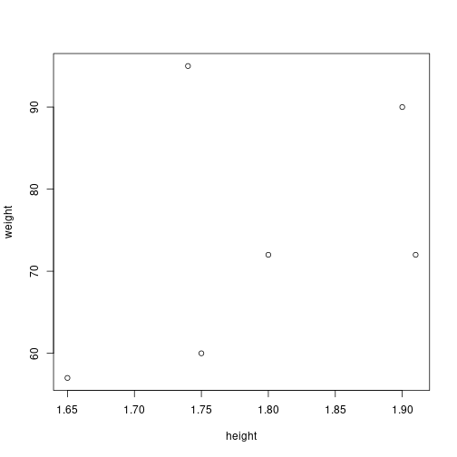
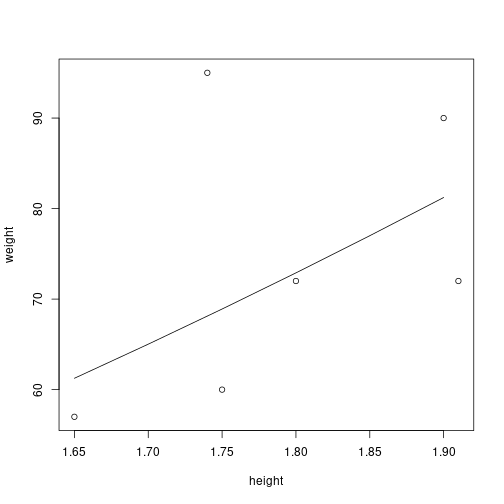

#### Installation of R packages


```r
#install.packages("ISwR")
```

#### Package loading


```r
library(ISwR)
```

#### Variable definition and assignment


```r
weight <- 60
height = 1.75
subject <- "A"
healthy <- TRUE
```

#### Variable evaluation


```r
weight
```

```
## [1] 60
```

#### Functions for type checking


```r
is.numeric(weight) # variable 
```

```
## [1] TRUE
```

```r
is.double(weight)
```

```
## [1] TRUE
```

```r
is.integer(weight)
```

```
## [1] FALSE
```

```r
is.character(subject)
```

```
## [1] TRUE
```

#### Functions for variable conversion


```r
weight <- as.integer(weight)
is.integer(weight)
```

```
## [1] TRUE
```

#### Computing the body mass index (BMI) from the weight and height


```r
#Body mass index (BMI)
bmi <- weight/height^2 
bmi 
```

```
## [1] 19.59184
```

#### Functions for string manipulation


```r
message <- sprintf("%.1f", bmi)
print(message)
```

```
## [1] "19.6"
```

#### Vector definition


```r
weight <- c(60, 72, 57, 90, 95, 72) 
height <- c(1.75, 1.80, 1.65, 1.90, 1.74, 1.91)
subject <- c("A", "B", "C", "D", "E", "F")
```

#### Vector evaluation


```r
weight
```

```
## [1] 60 72 57 90 95 72
```

```r
height
```

```
## [1] 1.75 1.80 1.65 1.90 1.74 1.91
```

```r
subject
```

```
## [1] "A" "B" "C" "D" "E" "F"
```

#### Creating a vector with a particular size


```r
vec <- rep(0, 10)
vec
```

```
##  [1] 0 0 0 0 0 0 0 0 0 0
```

#### Vector length


```r
length(weight)
```

```
## [1] 6
```

#### Vector indexes: from one to the length of the vector


```r
weight[1]
```

```
## [1] 60
```

```r
weight[length(weight)]
```

```
## [1] 72
```

#### Iteration: for loop
from one to the length of weight


```r
bmi <- 0
for (i in 1:length(weight)) {
  bmi[i] <- weight[i]/height[i]^2
}
```

evaluation of the bmi vector


```r
bmi
```

```
## [1] 19.59184 22.22222 20.93664 24.93075 31.37799 19.73630
```

#### Iteration: while loop
run while i is below or equal to the length of weight


```r
bmi <- 0
i <- 1
while (i <= length(weight)) {
  bmi[i] <- weight[i]/height[i]^2
  i <- i + 1
}
```


```r
bmi
```

```
## [1] 19.59184 22.22222 20.93664 24.93075 31.37799 19.73630
```

#### Remove a variable


```r
rm(bmi)
exists("bmi")
```

```
## [1] FALSE
```

#### Right way of manipulating vectors: assigning at once


```r
bmi <- weight/height^2 
bmi 
```

```
## [1] 19.59184 22.22222 20.93664 24.93075 31.37799 19.73630
```

#### Creating a function
name <- function(parameters) { body }


```r
compute_bmi <- function(weight, height) {
  bmi <- weight/height^2 
  return(bmi)
}
```

#### Using a function with scalars


```r
bmi <- compute_bmi(60, 1.75)
bmi
```

```
## [1] 19.59184
```

#### Using the same function with vectors


```r
bmi <- compute_bmi(weight, height)
bmi
```

```
## [1] 19.59184 22.22222 20.93664 24.93075 31.37799 19.73630
```

#### Example of a function to compute the average
(iterating in all elements of the vector)


```r
average <- function(vec) {
    s <- 0
    n <- length(vec)
    for (x in vec) {
      s <- s + x  
    }
    return(s/n)
}
```

invoking the function


```r
avg_bmi <- average(bmi)
avg_bmi
```

```
## [1] 23.13262
```

#### Example of a function to compute the average
(manipulating vectors at once)


```r
average <- function(vec) {
    s <- sum(vec)
    n <- length(vec)
    return(s/n)
}
```

invoking the function


```r
avg_bmi <- average(bmi)
avg_bmi
```

```
## [1] 23.13262
```

#### Average function using mean function
Major statistical functions are available in R


```r
average <- function(vec) {
    return(mean(vec))
}
```

invoking the function


```r
avg_bmi <- average(bmi)
avg_bmi
```

```
## [1] 23.13262
```

#### Working with vectors with NA
Operations with NA lead to NA.


```r
x <- c(10, NA, 13)
y <- average(x)
y
```

```
## [1] NA
```

#### addressing NA with na.rm=TRUE


```r
average <- function(vec) {
    return(mean(vec, na.rm=TRUE))
}
```


```r
x <- c(10, NA, 13)
y <- average(x)
y
```

```
## [1] 11.5
```

#### Plotting graphics
scatter plots


```r
plot(height, weight)
```



#### Most functions contain many default parameters


```r
plot(height, weight, pch=2)
```


#### Default function arguments can be shown with args


```r
args(plot.default)
```

```
## function (x, y = NULL, type = "p", xlim = NULL, ylim = NULL, 
##     log = "", main = NULL, sub = NULL, xlab = NULL, ylab = NULL, 
##     ann = par("ann"), axes = TRUE, frame.plot = axes, panel.first = NULL, 
##     panel.last = NULL, asp = NA, xgap.axis = NA, ygap.axis = NA, 
##     ...) 
## NULL
```

#### All functions in R that belongs to packages have help with examples


```r
?base::plot
```

#### Canvas for plotting is still active until a new plot


```r
plot(height, weight)
hh = c(1.65, 1.70, 1.75, 1.80, 1.85, 1.90)
lines(hh, 22.5 * hh^2)
```



#### Factors
Factors are used to handle categorical data.


```r
pain <- c(0,3,2,2,1)
fpain <- factor(pain,levels=0:3, ordered=TRUE)
fpain
```

```
## [1] 0 3 2 2 1
## Levels: 0 < 1 < 2 < 3
```

#### Levels provide correspondence between numerical values and categorical labels


```r
levels(fpain) <- c("none","mild","medium","severe")
fpain
```

```
## [1] none   severe medium medium mild  
## Levels: none < mild < medium < severe
```

#### Convert height to factor
Levels: small, medium, high

#### coding setting element by element


```r
lev <- rep("", length(height))

for (i in 1:length(height)) {
  if (height[i] < 1.7)
    lev[i] <- "short"
  else if (height[i] < 1.9)
    lev[i] <- "medium"
  else 
    lev[i] <- "tall"
}
lev <- as.factor(lev)
lev
```

```
## [1] medium medium short  tall   medium tall  
## Levels: medium short tall
```

#### coding setting the vector at once
It uses the cut function.


```r
lev <- cut(height, breaks=c(0, 1.7, 1.9, .Machine$double.xmax), ordered=TRUE)
lev
```

```
## [1] (1.7,1.9]      (1.7,1.9]      (0,1.7]        (1.7,1.9]      (1.7,1.9]      (1.9,1.8e+308]
## Levels: (0,1.7] < (1.7,1.9] < (1.9,1.8e+308]
```

```r
levels(lev) <- c("short", "medium", "tall")
lev
```

```
## [1] medium medium short  medium medium tall  
## Levels: short < medium < tall
```

#### Matrix
Matrices can be filled from vectors or data frames. 


```r
x <- 1:9
x
```

```
## [1] 1 2 3 4 5 6 7 8 9
```

#### Converting a vector to matrix


```r
dim(x) <- c(3,3)
x
```

```
##      [,1] [,2] [,3]
## [1,]    1    4    7
## [2,]    2    5    8
## [3,]    3    6    9
```

#### accessing elements from a matrix


```r
for (i in 1:nrow(x)) 
    for (j in 1:ncol(x))
        print(x[i,j])
```

```
## [1] 1
## [1] 4
## [1] 7
## [1] 2
## [1] 5
## [1] 8
## [1] 3
## [1] 6
## [1] 9
```

#### Iterating and assigning values to each element


```r
y <- x
for (i in 1:nrow(y)) 
    for (j in 1:ncol(y))
        y[i,j] <- 3 * y[i, j]
    
y
```

```
##      [,1] [,2] [,3]
## [1,]    3   12   21
## [2,]    6   15   24
## [3,]    9   18   27
```

#### Assigning the values of a matrix at once


```r
y <- 3*x
y
```

```
##      [,1] [,2] [,3]
## [1,]    3   12   21
## [2,]    6   15   24
## [3,]    9   18   27
```

#### Converting a vector to a matrix by row


```r
x <- matrix(1:9,nrow=3,byrow=T)
x
```

```
##      [,1] [,2] [,3]
## [1,]    1    2    3
## [2,]    4    5    6
## [3,]    7    8    9
```

#### transposing a matrix


```r
x <- t(x)
x
```

```
##      [,1] [,2] [,3]
## [1,]    1    4    7
## [2,]    2    5    8
## [3,]    3    6    9
```

#### computing the determinant of a matrix


```r
det(x)
```

```
## [1] 0
```

#### Lists
Lists are used to work with "objects"


```r
a <- c(5260,5470,5640,6180,6390,6515,6805,7515,7515,8230,8770)
b <- c(3910,4220,3885,5160,5645,4680,5265,5975,6790,6900,7335)

mybag <- list(a, b, 0, "a")
mybag
```

```
## [[1]]
##  [1] 5260 5470 5640 6180 6390 6515 6805 7515 7515 8230 8770
## 
## [[2]]
##  [1] 3910 4220 3885 5160 5645 4680 5265 5975 6790 6900 7335
## 
## [[3]]
## [1] 0
## 
## [[4]]
## [1] "a"
```

adding an element into a list


```r
n <- length(mybag)
mybag[[n+1]] <- "b"
mybag
```

```
## [[1]]
##  [1] 5260 5470 5640 6180 6390 6515 6805 7515 7515 8230 8770
## 
## [[2]]
##  [1] 3910 4220 3885 5160 5645 4680 5265 5975 6790 6900 7335
## 
## [[3]]
## [1] 0
## 
## [[4]]
## [1] "a"
## 
## [[5]]
## [1] "b"
```

#### List slicing


```r
slice <- mybag[1]
slice
```

```
## [[1]]
##  [1] 5260 5470 5640 6180 6390 6515 6805 7515 7515 8230 8770
```

```r
is.list(slice)
```

```
## [1] TRUE
```

#### Slicing is also a list


```r
slice <- mybag[c(1,3)]
slice
```

```
## [[1]]
##  [1] 5260 5470 5640 6180 6390 6515 6805 7515 7515 8230 8770
## 
## [[2]]
## [1] 0
```

```r
is.list(slice)
```

```
## [1] TRUE
```

#### A list is also a vector


```r
#list is also a vector
is.vector(slice)
```

```
## [1] TRUE
```

#### Member reference
It accesses the element


```r
h <- mybag[[1]]
h
```

```
##  [1] 5260 5470 5640 6180 6390 6515 6805 7515 7515 8230 8770
```

An element can be evaluated. 
In this case, it is a vector.


```r
is.vector(h)
```

```
## [1] TRUE
```

```r
is.list(h)
```

```
## [1] FALSE
```

#### Naming variables
They are properties on the list


```r
mybag <- list(x=a, y=b, const=0, lit="a")
mybag
```

```
## $x
##  [1] 5260 5470 5640 6180 6390 6515 6805 7515 7515 8230 8770
## 
## $y
##  [1] 3910 4220 3885 5160 5645 4680 5265 5975 6790 6900 7335
## 
## $const
## [1] 0
## 
## $lit
## [1] "a"
```

#### Adding, accessing, and removing elements


```r
mybag$c <- mybag$x - mybag$y
mybag$const <- NULL
mybag$lit <- NULL
mybag
```

```
## $x
##  [1] 5260 5470 5640 6180 6390 6515 6805 7515 7515 8230 8770
## 
## $y
##  [1] 3910 4220 3885 5160 5645 4680 5265 5975 6790 6900 7335
## 
## $c
##  [1] 1350 1250 1755 1020  745 1835 1540 1540  725 1330 1435
```

#### Data frames
Data frames (tables) provide support for structured data. 


```r
d <- data.frame(A=a, B=b)
head(d)
```

```
##      A    B
## 1 5260 3910
## 2 5470 4220
## 3 5640 3885
## 4 6180 5160
## 5 6390 5645
## 6 6515 4680
```

#### Adding a column in the data frame 


```r
d$c <- d$A + d$B
head(d)
```

```
##      A    B     c
## 1 5260 3910  9170
## 2 5470 4220  9690
## 3 5640 3885  9525
## 4 6180 5160 11340
## 5 6390 5645 12035
## 6 6515 4680 11195
```


```r
d$A <- NULL
head(d)
```

```
##      B     c
## 1 3910  9170
## 2 4220  9690
## 3 3885  9525
## 4 5160 11340
## 5 5645 12035
## 6 4680 11195
```

####  Reading csv file
There are many functions for reading CSV, Excel, and RData formats.


```r
wine = read.table(
    "http://archive.ics.uci.edu/ml/machine-learning-databases/wine/wine.data", 
                  header = TRUE, sep = ",")
  colnames(wine) <- c('Type', 'Alcohol', 'Malic', 'Ash', 
                      'Alcalinity', 'Magnesium', 'Phenols', 
                      'Flavanoids', 'Nonflavanoids',
                      'Proanthocyanins', 'Color', 'Hue', 
                      'Dilution', 'Proline')
head(wine)
```

```
##   Type Alcohol Malic  Ash Alcalinity Magnesium Phenols Flavanoids Nonflavanoids Proanthocyanins Color  Hue Dilution Proline
## 1    1   13.20  1.78 2.14       11.2       100    2.65       2.76          0.26            1.28  4.38 1.05     3.40    1050
## 2    1   13.16  2.36 2.67       18.6       101    2.80       3.24          0.30            2.81  5.68 1.03     3.17    1185
## 3    1   14.37  1.95 2.50       16.8       113    3.85       3.49          0.24            2.18  7.80 0.86     3.45    1480
## 4    1   13.24  2.59 2.87       21.0       118    2.80       2.69          0.39            1.82  4.32 1.04     2.93     735
## 5    1   14.20  1.76 2.45       15.2       112    3.27       3.39          0.34            1.97  6.75 1.05     2.85    1450
## 6    1   14.39  1.87 2.45       14.6        96    2.50       2.52          0.30            1.98  5.25 1.02     3.58    1290
```

####  saving in binary format 


```r
save(wine, file="wine.RData")
```

####  removing data frame from memory


```r
rm(wine)
```

####  load binary format


```r
load("wine.RData")
head(wine, 3)
```

```
##   Type Alcohol Malic  Ash Alcalinity Magnesium Phenols Flavanoids Nonflavanoids Proanthocyanins Color  Hue Dilution Proline
## 1    1   13.20  1.78 2.14       11.2       100    2.65       2.76          0.26            1.28  4.38 1.05     3.40    1050
## 2    1   13.16  2.36 2.67       18.6       101    2.80       3.24          0.30            2.81  5.68 1.03     3.17    1185
## 3    1   14.37  1.95 2.50       16.8       113    3.85       3.49          0.24            2.18  7.80 0.86     3.45    1480
```

####  exporting data.frame into csv file


```r
write.table(wine, file="wine.csv", row.names=FALSE, quote = FALSE, sep = ",")
```

####  filtering vectors


```r
a <- c(5260,5470,5640,6180,6390,6515,6805,7515,7515,8230,8770)
b <- c(3910,4220,3885,5160,5645,4680,5265,5975,6790,6900,7335)

# logical vector
bool <- (a > 7000)
bool
```

```
##  [1] FALSE FALSE FALSE FALSE FALSE FALSE FALSE  TRUE  TRUE  TRUE  TRUE
```


```r
# selecting elements from positions that are true
a[bool] 
```

```
## [1] 7515 7515 8230 8770
```


```r
# filtering with logical expressions
b[a < 6000 | a > 7000]
```

```
## [1] 3910 4220 3885 5975 6790 6900 7335
```


```r
b[6000 <= a & a <= 7000]
```

```
## [1] 5160 5645 4680 5265
```

####  filtering data frames


```r
data <- data.frame(a=a, b=b)
data$c <- data$a - data$b
head(data, nrow(data))
```

```
##       a    b    c
## 1  5260 3910 1350
## 2  5470 4220 1250
## 3  5640 3885 1755
## 4  6180 5160 1020
## 5  6390 5645  745
## 6  6515 4680 1835
## 7  6805 5265 1540
## 8  7515 5975 1540
## 9  7515 6790  725
## 10 8230 6900 1330
## 11 8770 7335 1435
```


```r
head(data[data$a > 7000,])
```

```
##       a    b    c
## 8  7515 5975 1540
## 9  7515 6790  725
## 10 8230 6900 1330
## 11 8770 7335 1435
```


```r
head(data[data$a > 7000,c(1,2)])
```

```
##       a    b
## 8  7515 5975
## 9  7515 6790
## 10 8230 6900
## 11 8770 7335
```

#### performance with matrix and data frames


```r
rheight <- rnorm(100000, 1.8, sd=0.2)
rweight <- rnorm(100000, 72, sd=15)
```

#### computing a entire column at once


```r
start_time <- Sys.time()
hw <- data.frame(height=rheight, weight=rweight)
hw$bmi <- hw$weight/hw$height^2
end_time <- Sys.time()
end_time - start_time
```

```
## Time difference of 0.003582001 secs
```

```r
object.size(hw)
```

```
## 2400984 bytes
```

#### processing cell by cell


```r
start_time <- Sys.time()
hw <- data.frame(height=rheight, weight=rweight)
for (i in 1:nrow(hw)) {
  hw$bmi[i] <- hw$weight[i]/hw$height[i]^2
}
end_time <- Sys.time()
end_time - start_time
```

```
## Time difference of 8.370247 secs
```

#### convert the entire column


```r
start_time <- Sys.time()
hw <- data.frame(height=rheight, weight=rweight)
hw <- as.matrix(hw)
hw <- cbind(hw, 0)
for (i in 1:nrow(hw)) {
  hw[i,3] <- hw[i,2]/hw[i,1]^2
}
end_time <- Sys.time()
end_time - start_time
```

```
## Time difference of 0.445226 secs
```

#### apply family

apply functions can be applied for all rows or columns. 

The first character of the function name establishes the return type (s: simple, l: list).


```r
library(ISwR)
data(thuesen)
head(thuesen)
```

```
##   blood.glucose short.velocity
## 1          15.3           1.76
## 2          10.8           1.34
## 3           8.1           1.27
## 4          19.5           1.47
## 5           7.2           1.27
## 6           5.3           1.49
```


```r
#lapply returns a list
lapply(thuesen, mean, na.rm=T)
```

```
## $blood.glucose
## [1] 10.3
## 
## $short.velocity
## [1] 1.325652
```


```r
#sapply returns a vector
sapply(thuesen, mean, na.rm=T)
```

```
##  blood.glucose short.velocity 
##      10.300000       1.325652
```


```r
# apply - second parameter (1: by rows, 2: by columns)
m <- as.matrix(thuesen)
apply(m, 1, min, na.rm=TRUE)
```

```
##  [1] 1.76 1.34 1.27 1.47 1.27 1.49 1.31 1.09 1.18 1.22 1.25 1.19 1.95 1.28 1.52 8.60 1.12 1.37 1.19 1.05 1.32 1.03 1.12 1.70
```

```r
apply(m, 2, min, na.rm=TRUE)
```

```
##  blood.glucose short.velocity 
##           4.20           1.03
```

### sort and order


```r
library(ISwR)
data(thuesen)
head(thuesen)
```

```
##   blood.glucose short.velocity
## 1          15.3           1.76
## 2          10.8           1.34
## 3           8.1           1.27
## 4          19.5           1.47
## 5           7.2           1.27
## 6           5.3           1.49
```


```r
sort(thuesen$blood.glucose)
```

```
##  [1]  4.2  4.9  5.2  5.3  6.7  6.7  7.2  7.5  8.1  8.6  8.8  9.3  9.5 10.3 10.8 11.1 12.2 12.5 13.3 15.1 15.3 16.1 19.0 19.5
```


```r
order(thuesen$blood.glucose)
```

```
##  [1] 17 22 12  6 11 15  5  9  3 16 23  7 24 18  2  8 10 19 21 14  1 20 13  4
```


```r
o <- order(thuesen$blood.glucose)
sorted <- thuesen[o,]
head(sorted)
```

```
##    blood.glucose short.velocity
## 17           4.2           1.12
## 22           4.9           1.03
## 12           5.2           1.19
## 6            5.3           1.49
## 11           6.7           1.25
## 15           6.7           1.52
```

#### Pipelines
The operator $\%$>$\%$ creates a pipeline. 

The first parameter of the next invoked function receives the data from the pipeline. 

Library $dplyr$ contains a set of functions that support relational algebra operations.


```r
flight_data <- read.table(text = "Year Quarter Flights Delays
                     2016 1 11 6
                     2016 2 12 5
                     2016 3 13 3
                     2016 4 12 5
                     2017 1 10 4
                     2017 2 9 3
                     2017 3 11 4
                     2017 4 25 15
                     2018 1 14 3
                     2018 2 12 5
                     2018 3 13 3
                     2018 4 15 4",
                     header = TRUE,sep = "")  
head(flight_data)
```

```
##   Year Quarter Flights Delays
## 1 2016       1      11      6
## 2 2016       2      12      5
## 3 2016       3      13      3
## 4 2016       4      12      5
## 5 2017       1      10      4
## 6 2017       2       9      3
```


```r
#install.packages("dplyr")
```


```r
library(dplyr)
result <- flight_data %>% 
   filter(Delays > 5) %>% 
   select(Year, Quarter, Flights)
head(result)
```

```
##   Year Quarter Flights
## 1 2016       1      11
## 2 2017       4      25
```


```r
library(dplyr)
result <- flight_data %>% 
   group_by(Year) %>% 
   summarize(mean = mean(Flights), sd = sd(Flights))
head(result)
```

```
## # A tibble: 3 × 3
##    Year  mean    sd
##   <int> <dbl> <dbl>
## 1  2016  12   0.816
## 2  2017  13.8 7.54 
## 3  2018  13.5 1.29
```


```r
nrow(flight_data)
```

```
## [1] 12
```

```r
head(flight_data)
```

```
##   Year Quarter Flights Delays
## 1 2016       1      11      6
## 2 2016       2      12      5
## 3 2016       3      13      3
## 4 2016       4      12      5
## 5 2017       1      10      4
## 6 2017       2       9      3
```


```r
#install.packages(reshape)
library(reshape)
result <- melt(flight_data[,c('Year', 'Quarter', 'Flights', 'Delays')], 
             id.vars = c(1,2))
nrow(result)
```

```
## [1] 24
```

```r
head(result[c(1:3,17:19), ])
```

```
##    Year Quarter variable value
## 1  2016       1  Flights    11
## 2  2016       2  Flights    12
## 3  2016       3  Flights    13
## 17 2017       1   Delays     4
## 18 2017       2   Delays     3
## 19 2017       3   Delays     4
```

#### merge

The function $merge$ can be used to join data frames. It can be used to produce inner, left, right, and outer joins. 


```r
stores <- data.frame(
  city = c("Rio de Janeiro", "Sao Paulo", "Paris", "New York", "Tokyo"),
  value = c(10, 12, 20, 25, 18))
head(stores)
```

```
##             city value
## 1 Rio de Janeiro    10
## 2      Sao Paulo    12
## 3          Paris    20
## 4       New York    25
## 5          Tokyo    18
```


```r
divisions <- data.frame(
  city = c("Rio de Janeiro", "Sao Paulo", "Paris", "New York", "Tokyo"),
  country = c("Brazil", "Brazil", "France", "US", "Japan"))
head(divisions)
```

```
##             city country
## 1 Rio de Janeiro  Brazil
## 2      Sao Paulo  Brazil
## 3          Paris  France
## 4       New York      US
## 5          Tokyo   Japan
```


```r
stdiv <- merge(stores, divisions, by.x="city", by.y="city")
head(stdiv)
```

```
##             city value country
## 1       New York    25      US
## 2          Paris    20  France
## 3 Rio de Janeiro    10  Brazil
## 4      Sao Paulo    12  Brazil
## 5          Tokyo    18   Japan
```


```r
result <- stdiv %>% group_by(country) %>% 
   summarize(count = n(), amount = sum(value))
head(result)
```

```
## # A tibble: 4 × 3
##   country count amount
##   <chr>   <int>  <dbl>
## 1 Brazil      2     22
## 2 France      1     20
## 3 Japan       1     18
## 4 US          1     25
```

#### statistical tests: t-test
There are many statistical tests in R.
One of the most used is the t-test. It checks if the mean of observations is not different from a theoretical value.


```r
weight <- c(60, 72, 57, 90, 95, 72) 
height <- c(1.75, 1.80, 1.65, 1.90, 1.74, 1.91)
bmi <- weight/height^2 
```


```r
t.test(bmi, mu=22.5)
```

```
## 
## 	One Sample t-test
## 
## data:  bmi
## t = 0.34488, df = 5, p-value = 0.7442
## alternative hypothesis: true mean is not equal to 22.5
## 95 percent confidence interval:
##  18.41734 27.84791
## sample estimates:
## mean of x 
##  23.13262
```

