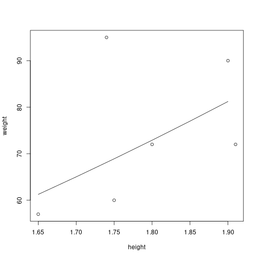

### Part 1


```r
1+2
```

```
## [1] 3
```


```r
1:10
```

```
##  [1]  1  2  3  4  5  6  7  8  9 10
```


```r
a <- 1
```


```r
a
```

```
## [1] 1
```


```r
a+2
```

```
## [1] 3
```


```r
dado <- 1:6
```


```r
dado
```

```
## [1] 1 2 3 4 5 6
```


```r
dado[1]
```

```
## [1] 1
```


```r
dado[6]
```

```
## [1] 6
```


```r
dado - 1
```

```
## [1] 0 1 2 3 4 5
```

#### Package Installation


```r
available <- require(ggplot2)
if (!available) 
    install.packages("ggplot2")
```

#### Package loading


```r
library(ggplot2)
```

#### Variable definitions


```r
weight <- 60
height = 1.75
subject <- "A"
healthy <- TRUE
```

#### Variable evaluation


```r
weight
```

```
## [1] 60
```

#### Variable type checking


```r
is.numeric(weight) # variable 
```

```
## [1] TRUE
```

```r
is.double(weight)
```

```
## [1] TRUE
```

```r
is.integer(weight)
```

```
## [1] FALSE
```

```r
is.character(subject)
```

```
## [1] TRUE
```

#### Variable conversion


```r
weight <- as.integer(weight)
is.integer(weight)
```

```
## [1] TRUE
```

#### Formulas


```r
#Body mass index (BMI)
bmi <- weight/height^2 
bmi 
```

```
## [1] 19.59184
```

#### String formatting


```r
message <- sprintf("%.1f", bmi)
print(message)
```

```
## [1] "19.6"
```

#### Vector definition


```r
weight <- c(60, 72, 57, 90, 95, 72) 
height <- c(1.75, 1.80, 1.65, 1.90, 1.74, 1.91)
subject <- c("A", "B", "C", "D", "E", "F")
```

#### Vector evaluation


```r
weight
```

```
## [1] 60 72 57 90 95 72
```

```r
height
```

```
## [1] 1.75 1.80 1.65 1.90 1.74 1.91
```

```r
subject
```

```
## [1] "A" "B" "C" "D" "E" "F"
```

#### Creating a vector with a particular size


```r
vec <- rep(0, 10)
vec
```

```
##  [1] 0 0 0 0 0 0 0 0 0 0
```

#### Vector length


```r
length(weight)
```

```
## [1] 6
```

#### Vector indexes


```r
weight[1]
```

```
## [1] 60
```

```r
weight[length(weight)]
```

```
## [1] 72
```

#### for loop


```r
bmi <- 0
for (i in 1:length(weight)) {
  bmi[i] <- weight[i]/height[i]^2
}
```


```r
bmi
```

```
## [1] 19.59184 22.22222 20.93664 24.93075 31.37799 19.73630
```

#### while loop


```r
i <- 1
while (i <= length(weight)) {
  bmi[i] <- weight[i]/height[i]^2
  i <- i + 1
}
```


```r
bmi
```

```
## [1] 19.59184 22.22222 20.93664 24.93075 31.37799 19.73630
```

#### Removing variable


```r
rm(bmi)
exists("bmi")
```

```
## [1] FALSE
```

#### Manipulating vectors efficiently


```r
bmi <- weight/height^2 
bmi 
```

```
## [1] 19.59184 22.22222 20.93664 24.93075 31.37799 19.73630
```

#### Function definition


```r
compute_bmi <- function(weight, height) {
  bmi <- weight/height^2 
  return(bmi)
}
```

#### Using with scalar


```r
bmi <- compute_bmi(60, 1.75)
bmi
```

```
## [1] 19.59184
```

#### Using with vectors


```r
bmi <- compute_bmi(weight, height)
bmi
```

```
## [1] 19.59184 22.22222 20.93664 24.93075 31.37799 19.73630
```

#### Average function


```r
average <- function(vec) {
    s <- 0
    n <- length(vec)
    for (x in vec) {
      s <- s + x  
    }
    return(s/n)
}
```


```r
avg_bmi <- average(bmi)
avg_bmi
```

```
## [1] 23.13262
```

#### Average function: improved version


```r
average <- function(vec) {
    s <- sum(vec)
    n <- length(vec)
    return(s/n)
}
```


```r
avg_bmi <- average(bmi)
avg_bmi
```

```
## [1] 23.13262
```

#### Average function: major statistical functions already exists


```r
average <- function(vec) {
    return(mean(vec))
}
```


```r
avg_bmi <- average(bmi)
avg_bmi
```

```
## [1] 23.13262
```

#### NA definition


```r
x <- c(10, NA, 13)
x
```

```
## [1] 10 NA 13
```

#### Evaluation with NA leads to NA


```r
average(x)
```

```
## [1] NA
```

#### Addressing NA


```r
average <- function(vec) {
    return(mean(vec, na.rm=TRUE))
}
```


```r
average(x)
```

```
## [1] 11.5
```

### Part #2

#### Setup variables


```r
weight <- c(60, 72, 57, 90, 95, 72) 
height <- c(1.75, 1.80, 1.65, 1.90, 1.74, 1.91)
subject <- c("A", "B", "C", "D", "E", "F")
```

#### Basic plot


```r
#options(repr.plot.width=5, repr.plot.height=5)
plot(height, weight)
```


#### Changing default values


```r
 plot(height, weight, pch=2)
```


#### Discovering default values


```r
args(plot.default)
```

```
## function (x, y = NULL, type = "p", xlim = NULL, ylim = NULL, 
##     log = "", main = NULL, sub = NULL, xlab = NULL, ylab = NULL, 
##     ann = par("ann"), axes = TRUE, frame.plot = axes, panel.first = NULL, 
##     panel.last = NULL, asp = NA, xgap.axis = NA, ygap.axis = NA, 
##     ...) 
## NULL
```


```r
?plot
```

#### Adding a line


```r
plot(height, weight)
hh = c(1.65, 1.70, 1.75, 1.80, 1.85, 1.90)
lines(hh, 22.5 * hh^2)
```



#### Factors


```r
pain <- c(0,3,2,2,1)
fpain <- factor(pain,levels=0:3, ordered=TRUE)
fpain
```

```
## [1] 0 3 2 2 1
## Levels: 0 < 1 < 2 < 3
```

#### Labeling categories


```r
levels(fpain) <- c("none","mild","medium","severe")
fpain
```

```
## [1] none   severe medium medium mild  
## Levels: none < mild < medium < severe
```

#### Convert double to factor


```r
lev <- rep("", length(height))

for (i in 1:length(height)) {
  if (height[i] < 1.7)
    lev[i] <- "short"
  else if (height[i] < 1.9)
    lev[i] <- "medium"
  else 
    lev[i] <- "tall"
}
lev <- as.factor(lev)
lev
```

```
## [1] medium medium short  tall   medium tall  
## Levels: medium short tall
```

#### Using cut function


```r
lev <- cut(height, breaks=c(0, 1.7, 1.9, .Machine$double.xmax), ordered=TRUE)
lev
```

```
## [1] (1.7,1.9]      (1.7,1.9]      (0,1.7]        (1.7,1.9]      (1.7,1.9]      (1.9,1.8e+308]
## Levels: (0,1.7] < (1.7,1.9] < (1.9,1.8e+308]
```

```r
levels(lev) <- c("short", "medium", "tall")
lev
```

```
## [1] medium medium short  medium medium tall  
## Levels: short < medium < tall
```

#### Matrix


```r
x <- 1:9
x
```

```
## [1] 1 2 3 4 5 6 7 8 9
```

#### Vector to matrix


```r
dim(x) <- c(3,3)
x
```

```
##      [,1] [,2] [,3]
## [1,]    1    4    7
## [2,]    2    5    8
## [3,]    3    6    9
```


```r
x
```

```
##      [,1] [,2] [,3]
## [1,]    1    4    7
## [2,]    2    5    8
## [3,]    3    6    9
```


```r
for (i in 1:nrow(x)) 
  for (j in 1:ncol(x))
    print(x[i,j])
```

```
## [1] 1
## [1] 4
## [1] 7
## [1] 2
## [1] 5
## [1] 8
## [1] 3
## [1] 6
## [1] 9
```


```r
y <- x
for (i in 1:nrow(y)) 
  for (j in 1:ncol(y))
    y[i,j] <- 3 * y[i, j]

y
```

```
##      [,1] [,2] [,3]
## [1,]    3   12   21
## [2,]    6   15   24
## [3,]    9   18   27
```

#### Multiplying matrix by 3


```r
y <- x
for (i in 1:nrow(y)) 
  for (j in 1:ncol(y))
    y[i,j] <- 3 * y[i, j]

y
```

```
##      [,1] [,2] [,3]
## [1,]    3   12   21
## [2,]    6   15   24
## [3,]    9   18   27
```


```r
y <- 3*x
y
```

```
##      [,1] [,2] [,3]
## [1,]    3   12   21
## [2,]    6   15   24
## [3,]    9   18   27
```

#### Vector to matrix by row


```r
x <- matrix(1:9,nrow=3,byrow=T)
x
```

```
##      [,1] [,2] [,3]
## [1,]    1    2    3
## [2,]    4    5    6
## [3,]    7    8    9
```

#### Transpose matrix


```r
x <- t(x)
x
```

```
##      [,1] [,2] [,3]
## [1,]    1    4    7
## [2,]    2    5    8
## [3,]    3    6    9
```


```r
a <- c(5260,5470,5640,6180,6390,6515,6805,7515,7515,8230,8770)
b <- c(3910,4220,3885,5160,5645,4680,5265,5975,6790,6900,7335)
```

#### Creating a list


```r
mybag <- list(a, b, 0, "a")
mybag
```

```
## [[1]]
##  [1] 5260 5470 5640 6180 6390 6515 6805 7515 7515 8230 8770
## 
## [[2]]
##  [1] 3910 4220 3885 5160 5645 4680 5265 5975 6790 6900 7335
## 
## [[3]]
## [1] 0
## 
## [[4]]
## [1] "a"
```

#### Adding an element in a list


```r
n <- length(mybag)
mybag[[n+1]] <- "b"
mybag
```

```
## [[1]]
##  [1] 5260 5470 5640 6180 6390 6515 6805 7515 7515 8230 8770
## 
## [[2]]
##  [1] 3910 4220 3885 5160 5645 4680 5265 5975 6790 6900 7335
## 
## [[3]]
## [1] 0
## 
## [[4]]
## [1] "a"
## 
## [[5]]
## [1] "b"
```

#### Slicing a list


```r
slice <- mybag[1]
slice
```

```
## [[1]]
##  [1] 5260 5470 5640 6180 6390 6515 6805 7515 7515 8230 8770
```

```r
is.list(slice)
```

```
## [1] TRUE
```


```r
slice <- mybag[c(1,3)]
slice
```

```
## [[1]]
##  [1] 5260 5470 5640 6180 6390 6515 6805 7515 7515 8230 8770
## 
## [[2]]
## [1] 0
```

```r
is.list(slice)
```

```
## [1] TRUE
```


```r
#list is also a vector
is.vector(slice)
```

```
## [1] TRUE
```

#### Extracting an element from a list


```r
h <- mybag[[1]]
h
```

```
##  [1] 5260 5470 5640 6180 6390 6515 6805 7515 7515 8230 8770
```


```r
is.vector(h)
```

```
## [1] TRUE
```

```r
is.list(h)
```

```
## [1] FALSE
```

#### Adding, accessing, and removing elements


```r
mybag <- list(x=a, y=b, const=0, lit="a")
mybag
```

```
## $x
##  [1] 5260 5470 5640 6180 6390 6515 6805 7515 7515 8230 8770
## 
## $y
##  [1] 3910 4220 3885 5160 5645 4680 5265 5975 6790 6900 7335
## 
## $const
## [1] 0
## 
## $lit
## [1] "a"
```


```r
mybag$c <- mybag$x - mybag$y
mybag[[4]] <- NULL
mybag$const <- NULL
mybag
```

```
## $x
##  [1] 5260 5470 5640 6180 6390 6515 6805 7515 7515 8230 8770
## 
## $y
##  [1] 3910 4220 3885 5160 5645 4680 5265 5975 6790 6900 7335
## 
## $c
##  [1] 1350 1250 1755 1020  745 1835 1540 1540  725 1330 1435
```

### Part #3


```r
a <- c(5260,5470,5640,6180,6390,6515,6805,7515,7515,8230,8770)
b <- c(3910,4220,3885,5160,5645,4680,5265,5975,6790,6900,7335)
```


```r
d <- data.frame(A=a, B=b)
head(d)
```

```
##      A    B
## 1 5260 3910
## 2 5470 4220
## 3 5640 3885
## 4 6180 5160
## 5 6390 5645
## 6 6515 4680
```


```r
d$C <- d$A + d$B
head(d)
```

```
##      A    B     C
## 1 5260 3910  9170
## 2 5470 4220  9690
## 3 5640 3885  9525
## 4 6180 5160 11340
## 5 6390 5645 12035
## 6 6515 4680 11195
```


```r
d$A <- NULL
head(d)
```

```
##      B     C
## 1 3910  9170
## 2 4220  9690
## 3 3885  9525
## 4 5160 11340
## 5 5645 12035
## 6 4680 11195
```


```r
wine = read.table(
  "http://archive.ics.uci.edu/ml/machine-learning-databases/wine/wine.data", 
  header = TRUE, sep = ",")
head(wine)
```

```
##   X1 X14.23 X1.71 X2.43 X15.6 X127 X2.8 X3.06 X.28 X2.29 X5.64 X1.04 X3.92 X1065
## 1  1  13.20  1.78  2.14  11.2  100 2.65  2.76 0.26  1.28  4.38  1.05  3.40  1050
## 2  1  13.16  2.36  2.67  18.6  101 2.80  3.24 0.30  2.81  5.68  1.03  3.17  1185
## 3  1  14.37  1.95  2.50  16.8  113 3.85  3.49 0.24  2.18  7.80  0.86  3.45  1480
## 4  1  13.24  2.59  2.87  21.0  118 2.80  2.69 0.39  1.82  4.32  1.04  2.93   735
## 5  1  14.20  1.76  2.45  15.2  112 3.27  3.39 0.34  1.97  6.75  1.05  2.85  1450
## 6  1  14.39  1.87  2.45  14.6   96 2.50  2.52 0.30  1.98  5.25  1.02  3.58  1290
```

#### Saving RData file


```r
# in Linux the default is not to compress
save(wine, file="wine.RData", compress=TRUE)
```


```r
rm(wine)
```

#### Load RData file


```r
load("wine.RData")
head(wine, 3)
```

```
##   X1 X14.23 X1.71 X2.43 X15.6 X127 X2.8 X3.06 X.28 X2.29 X5.64 X1.04 X3.92 X1065
## 1  1  13.20  1.78  2.14  11.2  100 2.65  2.76 0.26  1.28  4.38  1.05  3.40  1050
## 2  1  13.16  2.36  2.67  18.6  101 2.80  3.24 0.30  2.81  5.68  1.03  3.17  1185
## 3  1  14.37  1.95  2.50  16.8  113 3.85  3.49 0.24  2.18  7.80  0.86  3.45  1480
```

#### Export data.frame into csv file


```r
write.table(wine, file="wine.csv", row.names=FALSE, quote = FALSE, sep = ",")
```

#### Filtering


```r
a <- c(5260,5470,5640,6180,6390,6515,6805,7515,7515,8230,8770)
b <- c(3910,4220,3885,5160,5645,4680,5265,5975,6790,6900,7335)
```


```r
# logical vector
i <- (a > 7000)
i
```

```
##  [1] FALSE FALSE FALSE FALSE FALSE FALSE FALSE  TRUE  TRUE  TRUE  TRUE
```


```r
a[i]
```

```
## [1] 7515 7515 8230 8770
```


```r
b[a < 6000 | a > 7000]
```

```
## [1] 3910 4220 3885 5975 6790 6900 7335
```


```r
b[6000 <= a & a <= 7000]
```

```
## [1] 5160 5645 4680 5265
```

#### Filtering data frames


```r
data <- data.frame(a=a, b=b)
data$c <- data$a - data$b
head(data, nrow(data))
```

```
##       a    b    c
## 1  5260 3910 1350
## 2  5470 4220 1250
## 3  5640 3885 1755
## 4  6180 5160 1020
## 5  6390 5645  745
## 6  6515 4680 1835
## 7  6805 5265 1540
## 8  7515 5975 1540
## 9  7515 6790  725
## 10 8230 6900 1330
## 11 8770 7335 1435
```


```r
head(data[data$a > 7000,])
```

```
##       a    b    c
## 8  7515 5975 1540
## 9  7515 6790  725
## 10 8230 6900 1330
## 11 8770 7335 1435
```


```r
head(data[data$a > 7000,c(1,2)])
```

```
##       a    b
## 8  7515 5975
## 9  7515 6790
## 10 8230 6900
## 11 8770 7335
```

#### Benchmarking matrix and data.frames


```r
rheight <- rnorm(100000, 1.8, sd=0.2)
rweight <- rnorm(100000, 72, sd=15)
```

#### Computing an entire column at once


```r
start_time <- Sys.time()
hw <- data.frame(height=rheight, weight=rweight)
hw$bmi <- hw$weight/hw$height^2
end_time <- Sys.time()
end_time - start_time
```

```
## Time difference of 0.003065586 secs
```

```r
object.size(hw)
```

```
## 2400984 bytes
```

#### Processing element by element


```r
start_time <- Sys.time()
hw <- data.frame(height=rheight, weight=rweight)
for (i in 1:nrow(hw)) {
  hw$bmi[i] <- hw$weight[i]/hw$height[i]^2
}
end_time <- Sys.time()
end_time - start_time
```

```
## Time difference of 8.658953 secs
```

#### Convert the entire data.frame


```r
start_time <- Sys.time()
hw <- data.frame(height=rheight, weight=rweight)
hw <- as.matrix(hw)
hw <- cbind(hw, 0)
for (i in 1:nrow(hw)) {
  hw[i,3] <- hw[i,2]/hw[i,1]^2
}
end_time <- Sys.time()
end_time - start_time
```

```
## Time difference of 0.4507401 secs
```

#### apply family


```r
library(ISwR)
data(thuesen)
head(thuesen)
```

```
##   blood.glucose short.velocity
## 1          15.3           1.76
## 2          10.8           1.34
## 3           8.1           1.27
## 4          19.5           1.47
## 5           7.2           1.27
## 6           5.3           1.49
```


```r
lapply(thuesen, mean, na.rm=T)
```

```
## $blood.glucose
## [1] 10.3
## 
## $short.velocity
## [1] 1.325652
```


```r
sapply(thuesen, mean, na.rm=T)
```

```
##  blood.glucose short.velocity 
##      10.300000       1.325652
```


```r
m <- as.matrix(thuesen)
apply(m, 1, min, na.rm=TRUE)
```

```
##  [1] 1.76 1.34 1.27 1.47 1.27 1.49 1.31 1.09 1.18 1.22 1.25 1.19 1.95 1.28 1.52 8.60 1.12 1.37 1.19 1.05 1.32 1.03 1.12 1.70
```

```r
apply(m, 2, min, na.rm=TRUE)
```

```
##  blood.glucose short.velocity 
##           4.20           1.03
```


```r
library(ISwR)
data(thuesen)
head(thuesen)
```

```
##   blood.glucose short.velocity
## 1          15.3           1.76
## 2          10.8           1.34
## 3           8.1           1.27
## 4          19.5           1.47
## 5           7.2           1.27
## 6           5.3           1.49
```


```r
sort(thuesen$blood.glucose)
```

```
##  [1]  4.2  4.9  5.2  5.3  6.7  6.7  7.2  7.5  8.1  8.6  8.8  9.3  9.5 10.3 10.8 11.1 12.2 12.5 13.3 15.1 15.3 16.1 19.0 19.5
```


```r
order(thuesen$blood.glucose)
```

```
##  [1] 17 22 12  6 11 15  5  9  3 16 23  7 24 18  2  8 10 19 21 14  1 20 13  4
```


```r
o <- order(thuesen$blood.glucose)
sorted <- thuesen[o,]
head(sorted)
```

```
##    blood.glucose short.velocity
## 17           4.2           1.12
## 22           4.9           1.03
## 12           5.2           1.19
## 6            5.3           1.49
## 11           6.7           1.25
## 15           6.7           1.52
```

### Part #4


```r
weight <- c(60, 72, 57, 90, 95, 72) 
height <- c(1.75, 1.80, 1.65, 1.90, 1.74, 1.91)
subject <- c("A", "B", "C", "D", "E", "F")
d <- data.frame(weight=weight, height=height, subject=subject)
head(d)   
```

```
##   weight height subject
## 1     60   1.75       A
## 2     72   1.80       B
## 3     57   1.65       C
## 4     90   1.90       D
## 5     95   1.74       E
## 6     72   1.91       F
```


```r
subject <- c("A", "B", "C", "D", "E", "F")
state <- c("RJ", "SP", "MG", "RJ", "SP", "MG")
ds <- data.frame(subject=subject, state=state)
head(d)
```

```
##   weight height subject
## 1     60   1.75       A
## 2     72   1.80       B
## 3     57   1.65       C
## 4     90   1.90       D
## 5     95   1.74       E
## 6     72   1.91       F
```


```r
dsm <- merge(d, ds, by.x="subject", by.y="subject")
head(dsm)    
```

```
##   subject weight height state
## 1       A     60   1.75    RJ
## 2       B     72   1.80    SP
## 3       C     57   1.65    MG
## 4       D     90   1.90    RJ
## 5       E     95   1.74    SP
## 6       F     72   1.91    MG
```


```r
lib <- require(dplyr)
if (!lib)
    install.packages("dplyr")
library(dplyr)
```


```r
result <- dsm |> 
    filter(height>1.7) |> 
    select(subject, weight, height) |> 
    arrange(height)
head(result)    
```

```
##   subject weight height
## 1       E     95   1.74
## 2       A     60   1.75
## 3       B     72   1.80
## 4       D     90   1.90
## 5       F     72   1.91
```


```r
result <- dsm |> 
    group_by(state) |>
    summarize(count = n(), height = mean(height))
head(result)    
```

```
## # A tibble: 3 × 3
##   state count height
##   <chr> <int>  <dbl>
## 1 MG        2   1.78
## 2 RJ        2   1.82
## 3 SP        2   1.77
```

